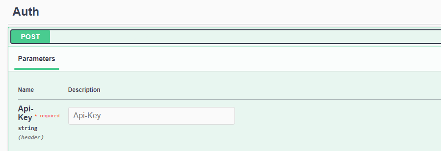
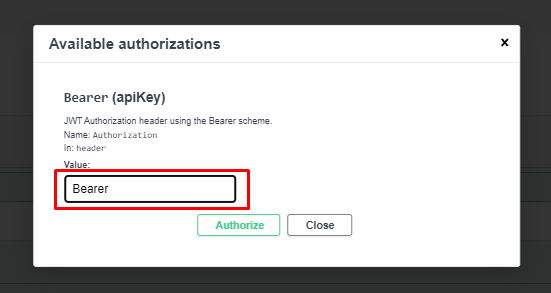
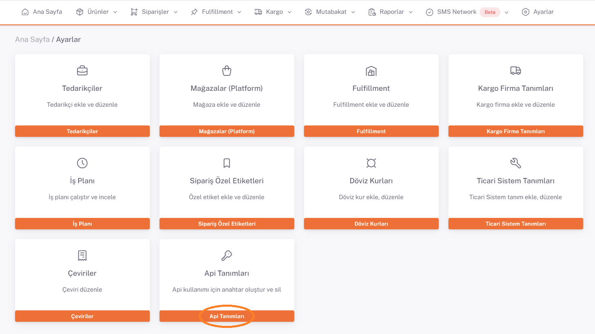
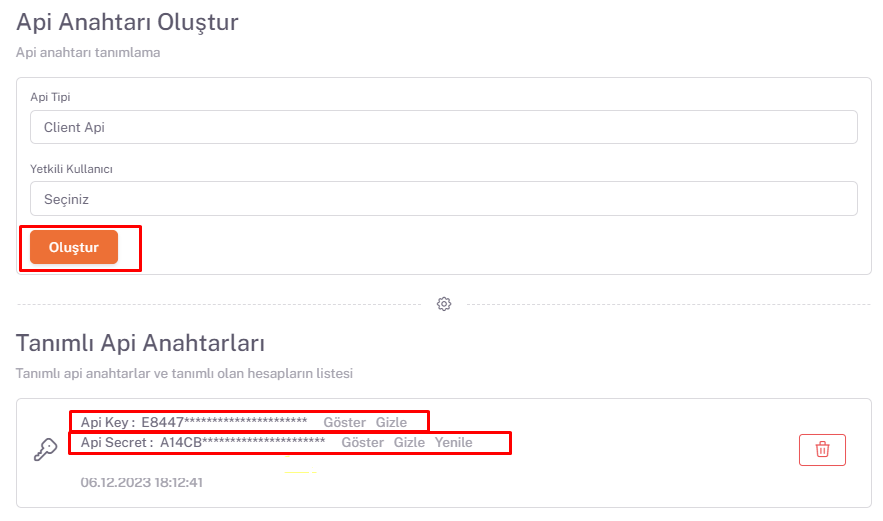

# Token Alma

### Request


Api tarafından verilen **Auth Token** bilgisini api authorization içerisine giriyoruz.



**Api-Key (Required)** parametre bilgilerinize Shopiverse panelde bulunan **Ana Sayfa > Ayarlar > Api Tanımları** bölümünden ulaşabilirsiniz. Api İstek limiti **dakikada 2 istek** olarak sabitlenmiştir.




:::note
ShopiVerse Api üzerinden gerekli isteği oluşturarak Token alabileceğiniz **[Auth Api OwnToken](https://api.shopiverse.com/swagger/index.html "Auth Api OwmToken")** metodunu deneyebilirsiniz.
:::

### Responses

#### Code 200 Success Response
```json
{
  "data": {
    "token": "string",
    "tokenType": "string",
    "expiration": "2023-05-24T14:15:06.683Z"
  },
  "success": true,
  "message": "string"
}
```

#### Code 400 BadRequest
```json
{
  "success": true,
  "message": "string"
}
```
