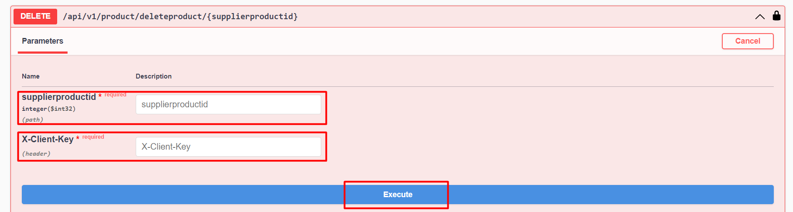

# Ürün Silme

### Parametre



:::note
X-Client Key   Shopiverse panelde Api Tanımlarında bulunan APİ-Key bilgisidir.Api İstek limiti **dakikada 2 istek** olarak sabitlenmiştir.
:::

:::note
Shopiverse üzerinde bulunan ürün silme için ShopiVerse Api üzerinden gerekli bilgileri yukarıdaki gibi girip gerekli isteği oluşturarak **[Product Api DeleteProducts](https://api.shopiverse.com/swagger/index.html "Products API Delete Products")** metodunu deneyebilirsiniz.
:::

### Responses

#### Code 200 Success Response
```json
{
  "success": true,
  "message": "string"
}
```

#### Code 400 BadRequest
```json
{
  "success": true,
  "message": "string"
}
```
