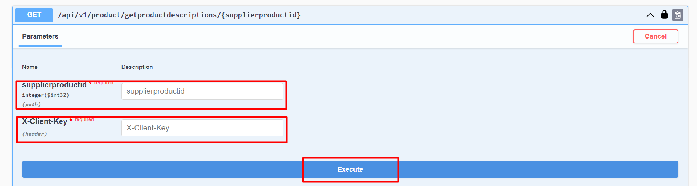

# Ürün Açıklamalarını Getir

### Parametre



:::note
X-Client Key   Shopiverse panelde Api Tanımlarında bulunan APİ-Key bilgisidir.Api İstek limiti **dakikada 2 istek** olarak sabitlenmiştir.
:::

:::note
Shopiverse üzerinde bulunan ürünlerin açıklama bilgilerini ShopiVerse Api üzerinden gerekli bilgileri yukarıdaki gibi girip gerekli isteği oluşturarak **[Product Api GetProduct Descriptions](https://api.shopiverse.com/swagger/index.html "Products API Get Product Descriptions")** metodunu deneyebilirsiniz.
:::

### Responses

#### Code 200 Success Response
```json
{
  "data": [
    {
      "id": 0,
      "supplierProductId": 0,
      "language": "0 - TR",
      "productName": "string",
      "shortDescription": "string",
      "description": "string",
      "productMaintenanceUseInfo": "string",
      "tags": "string",
      "addTime": "2024-03-05T10:33:55.267Z",
      "editTime": "2024-03-05T10:33:55.267Z"
    }
  ],
  "success": true,
  "message": "string"
}
```

#### Code 400 BadRequest
```json
{
  "success": true,
  "message": "string"
}
```
