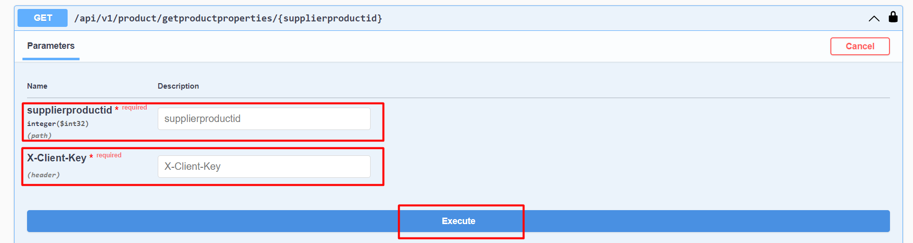

# Ürün Özelliklerini Getir

### Parametre



:::note
X-Client Key   Shopiverse panelde Api Tanımlarında bulunan APİ-Key bilgisidir.Api İstek limiti **dakikada 2 istek** olarak sabitlenmiştir.
:::

:::note
Shopiverse üzerinde bulunan ürünlerin özellik bilgilerini ShopiVerse Api üzerinden gerekli bilgileri yukarıdaki gibi girip gerekli isteği oluşturarak **[Product Api GetProduct Property](https://api.shopiverse.com/swagger/index.html "Products API Get Product Property")** metodunu deneyebilirsiniz.
:::

### Responses

#### Code 200 Success Response
```json
{
  "data": [
    {
      "id": 0,
      "supplierProductId": 0,
      "rowNumber": 0,
      "propertyName": "0 - Materyal",
      "propertyValue": "string",
      "addTime": "2024-03-05T10:26:08.926Z",
      "editTime": "2024-03-05T10:26:08.926Z"
    }
  ],
  "success": true,
  "message": "string"
}
```

#### Code 400 BadRequest
```json
{
  "success": true,
  "message": "string"
}
```
