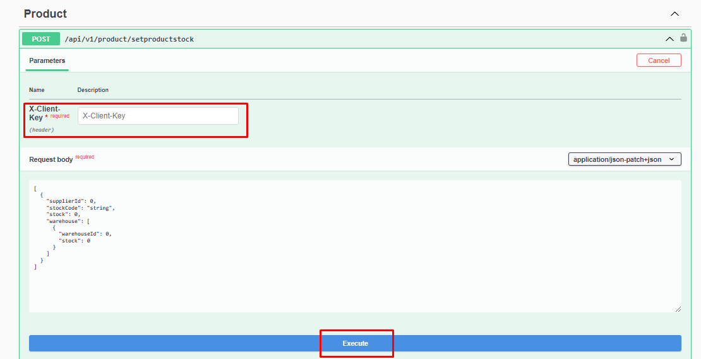
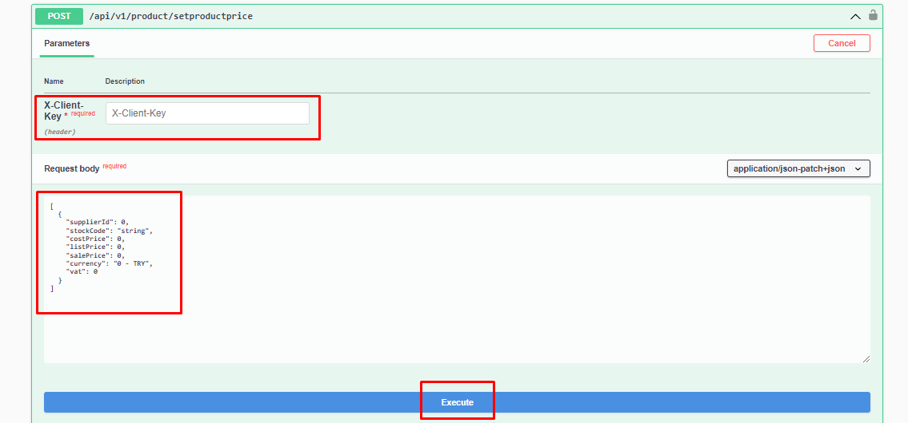

# Ürün Stock-Fiyat Ekleme

### Parametre




:::note
X-Client Key   Shopiverse panelde Api Tanımlarında bulunan APİ-Key bilgisidir.Api İstek limiti **dakikada 2 istek** olarak sabitlenmiştir.
:::

```json
 [
  {
    "supplierId": 0,
    "stockCode": "string",
    "stock": 0,
    "warehouse": [
      {
        "warehouseId": 0,
        "stock": 0
      }
    ]
  }
]
```

:::note
Shopiverse üzerinde bulunan ürünlerin stok fiyat bilgilerini ShopiVerse Api üzerinden gerekli bilgileri yukarıdaki gibi girip gerekli isteği oluşturarak **[Product Api SetProductStock](https://api.shopiverse.com/swagger/index.html "Warehouse Api ProductStock")** metodunu deneyebilirsiniz.
:::

### Responses

#### Code 200 Success Response
```json
{
  "data": {
    "taskCode": "string"
  },
  "success": true,
  "message": "string"
}
```

#### Code 400 BadRequest
```json
{
  "success": true,
  "message": "string"
}
```
