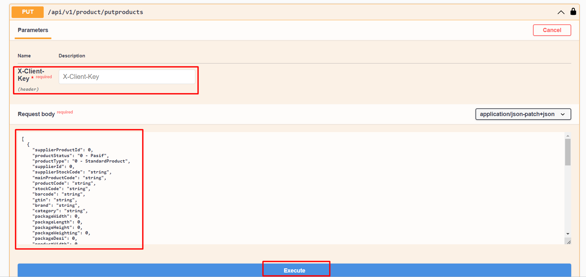

# Ürün Güncelleme

### Parametre



:::note
X-Client Key   Shopiverse panelde Api Tanımlarında bulunan APİ-Key bilgisidir.Api İstek limiti **dakikada 2 istek** olarak sabitlenmiştir.
:::

:::note
Shopiverse üzerinde bulunan ürün güncelleme için ShopiVerse Api üzerinden gerekli bilgileri yukarıdaki gibi girip gerekli isteği oluşturarak **[Product Api PutProducts](https://api.shopiverse.com/swagger/index.html "Products API Put Products")** metodunu deneyebilirsiniz.
:::

### Request

#### Request
```json
[
  {
    "supplierProductId": 0,
    "productStatus": "0 - Pasif",
    "productType": "0 - StandardProduct",
    "supplierId": 0,
    "supplierStockCode": "string",
    "mainProductCode": "string",
    "productCode": "string",
    "stockCode": "string",
    "barcode": "string",
    "gtin": "string",
    "brand": "string",
    "category": "string",
    "packageWidth": 0,
    "packageLength": 0,
    "packageHeight": 0,
    "packageWeighting": 0,
    "packageDesi": 0,
    "productWidth": 0,
    "productLength": 0,
    "productHeight": 0,
    "productWeighting": 0,
    "productDesi": 0,
    "stock": 0,
    "costPrice": 0,
    "listPrice": 0,
    "salePrice": 0,
    "currency": "0 - TRY",
    "vat": 0,
    "videoUrl": "string",
    "images": [
      {
        "rowNumber": 0,
        "imageUrl": "string"
      }
    ],
    "descriptions": [
      {
        "language": "0 - TR",
        "productName": "string",
        "shortDescription": "string",
        "description": "string",
        "productMaintenanceUseInfo": "string",
        "tags": [
          "string"
        ]
      }
    ],
    "properties": [
      {
        "propertyName": "0 - Materyal",
        "propertyValue": "string"
      }
    ],
    "attributes": [
      {
        "attributeName": "0 - Renk",
        "attributeValue": "string"
      }
    ],
    "bundles": [
      {
        "bundleSupplierProductId": 0,
        "bundleStock": 0
      }
    ]
  }
]
```


### Responses

#### Code 200 Success Response
```json
{
  "data": {
    "taskCode": "string"
  },
  "success": true,
  "message": "string"
}
```

#### Code 400 BadRequest
```json
{
  "success": true,
  "message": "string"
}
```
