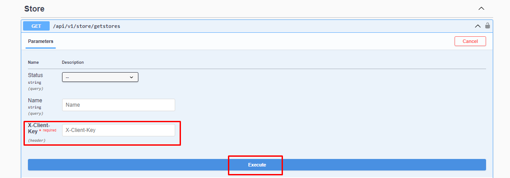

# Mağazaları Getirme

### Request Body



:::note
X-Client Key   Shopiverse panelde Api Tanımlarında bulunan APİ-Key bilgisidir.Api İstek limiti **dakikada 2 istek** olarak sabitlenmiştir.
:::

```json
{
  "status": 0,
  "name": "string",
  "marketplaceTypes": [
    0
  ]
}
```

:::note
Shopiverse üzerinde bulunan mağazalarınızı çekmek için ShopiVerse Api üzerinden gerekli bilgileri yukarıdaki gibi girip gerekli isteği oluşturarak **[Store Api GetStores](https://api.shopiverse.com/swagger/index.html "Store Api GetStores")** metodunu deneyebilirsiniz.
:::

### Responses

#### Code 200 Success Response
```json
{
  "data": [
    {
      "id": 0,
      "status": 0,
      "name": "string",
      "marketplaceType": 0
    }
  ],
  "success": true,
  "message": "string"
}
```

#### Code 400 BadRequest
```json
{
  "success": true,
  "message": "string"
}
```
