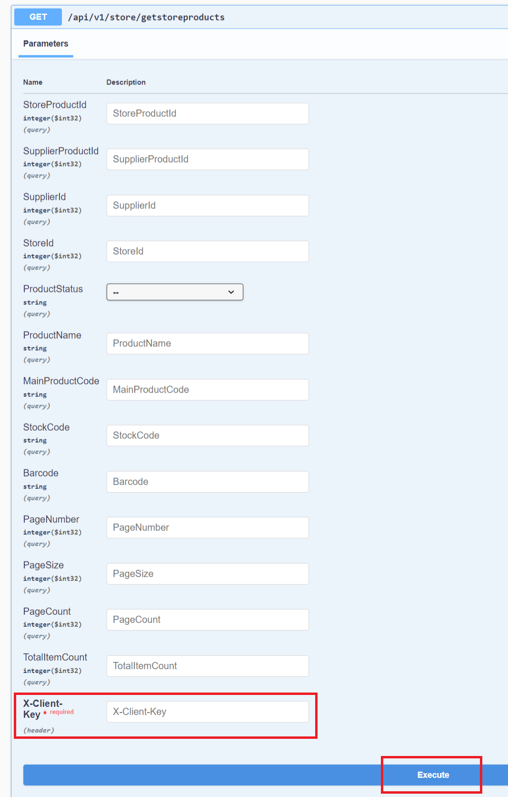

# Mağaza Ürünleri Getirme



:::note
X-Client Key   Shopiverse panelde Api Tanımlarında bulunan APİ-Key bilgisidir.Api İstek limiti **dakikada 2 istek** olarak sabitlenmiştir.
:::

:::note
Shopiverse üzerinde bulunan mağaza ürünleri çekmek için ShopiVerse Api üzerinden gerekli bilgileri yukarıdaki gibi girip gerekli isteği oluşturarak **[Store Api GetStoreProducts](https://api.shopiverse.com/swagger/index.html "Store Api GetStoreProducts")** metodunu deneyebilirsiniz.
:::

### Responses

#### Code 200 Success Response
```json
{
  "data": {
    "data": [
      {
        "storeProductId": 0,
        "productStatus": "0 - Pasif",
        "supplierProductId": 0,
        "supplierId": 0,
        "storeId": 0,
        "marketplaceType": "0 - Etsy",
        "mainProductCode": "string",
        "stockCode": "string",
        "barcode": "string",
        "gtin": "string",
        "stock": 0,
        "listPrice": 0,
        "salePrice": 0,
        "currency": "0 - TRY",
        "productName": "string",
        "shortDescription": "string",
        "description": "string",
        "sizeChart": "string",
        "tags": "string",
        "brand": "string",
        "videoUrl": "string",
        "addTime": "2024-03-05T11:35:58.894Z",
        "editTime": "2024-03-05T11:35:58.894Z"
      }
    ],
    "pageCount": 0,
    "pageNumber": 0,
    "pageSize": 0,
    "totalItemCount": 0
  },
  "success": true,
  "message": "string"
}
```

#### Code 400 BadRequest
```json
{
  "success": true,
  "message": "string"
}
```
