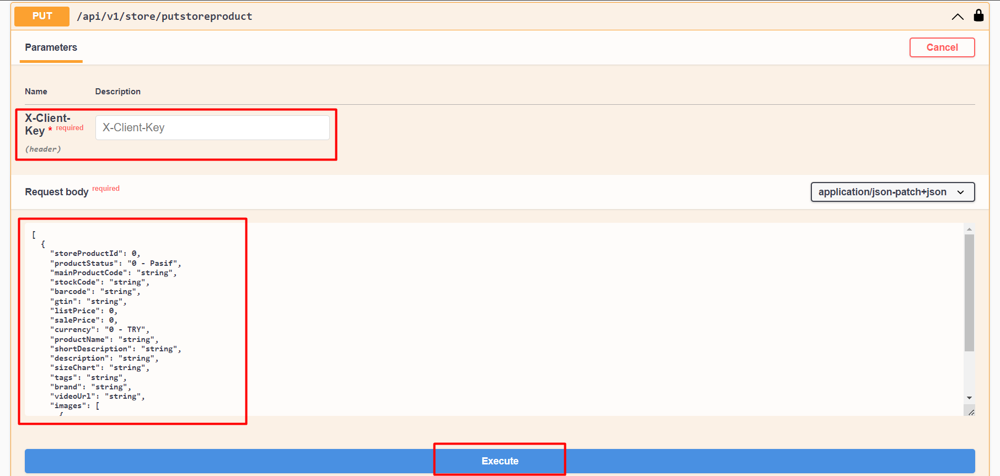

# Mağaza Ürün Güncelleme

### Request Body




:::note
X-Client Key   Shopiverse panelde Api Tanımlarında bulunan APİ-Key bilgisidir.Api İstek limiti **dakikada 2 istek** olarak sabitlenmiştir.
:::

```json
[
  {
    "storeProductId": 0,
    "productStatus": "0 - Pasif",
    "mainProductCode": "string",
    "stockCode": "string",
    "barcode": "string",
    "gtin": "string",
    "listPrice": 0,
    "salePrice": 0,
    "currency": "0 - TRY",
    "productName": "string",
    "shortDescription": "string",
    "description": "string",
    "sizeChart": "string",
    "tags": "string",
    "brand": "string",
    "videoUrl": "string",
    "images": [
      {
        "rowNumber": 0,
        "imageUrl": "string"
      }
    ]
  }
]
```

:::note
Shopiverse üzerinde bulunan mağazalarınızdaki ürünleri güncellemek için ShopiVerse Api üzerinden gerekli bilgileri yukarıdaki gibi girip gerekli isteği oluşturarak **[Store Api PutStoreProduct](https://api.shopiverse.com/swagger/index.html "Store Api PutStoreProduct")** metodunu deneyebilirsiniz.
:::

### Responses

#### Code 200 Success Response
```json
{
  "data": {
    "taskCode": "string"
  },
  "success": true,
  "message": "string"
}
```

#### Code 400 BadRequest
```json
{
  "success": true,
  "message": "string"
}
```
