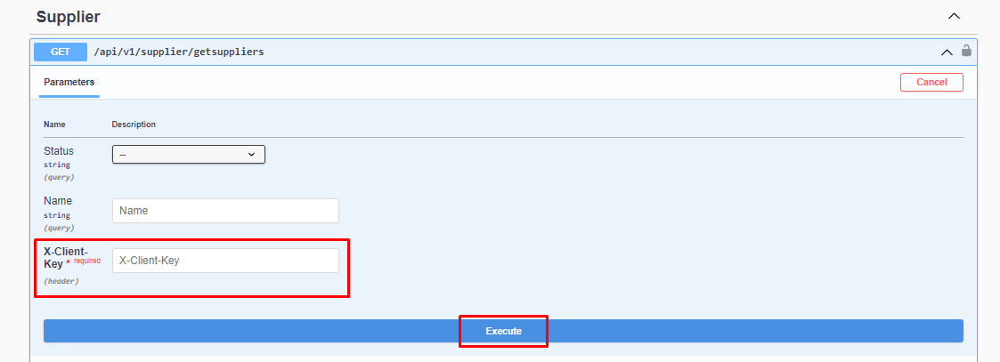

# Tedarikçileri Getirme

### Parametre




:::note
X-Client Key   Shopiverse panelde Api Tanımlarında bulunan APİ-Key bilgisidir.Api İstek limiti **dakikada 2 istek** olarak sabitlenmiştir.
:::

```json
 Status : string Aktif(1) , Pasif(0)
 Name : string
```

:::note
Shopiverse üzerinde bulunan tedarikçileri çekmek için ShopiVerse Api üzerinden gerekli bilgileri yukarıdaki gibi girip gerekli isteği oluşturarak **[Supplier Api GetSupplier](https://api.shopiverse.com/swagger/index.html "Supplier Api GetSuppliers")** metodunu deneyebilirsiniz.
:::

### Responses

#### Code 200 Success Response
```json
{
  "data": [
    {
      "id": 0,
      "status": "0 - Pasif",
      "code": "string",
      "name": "string"
    }
  ],
  "success": true,
  "message": "string"
}
```

#### Code 400 BadRequest
```json
{
  "success": true,
  "message": "string"
}
```
