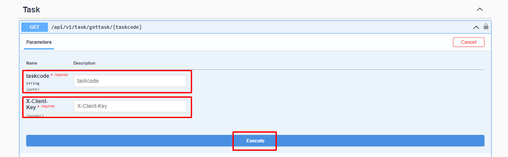

# Görevleri Getirme

### Parametre




:::note
X-Client Key   Shopiverse panelde Api Tanımlarında bulunan APİ-Key bilgisidir.Api İstek limiti **dakikada 2 istek** olarak sabitlenmiştir.
:::

```json
 taskcode : string 
```

:::note
Shopiverse üzerinde bulunan tedarikçileri çekmek için ShopiVerse Api üzerinden gerekli bilgileri yukarıdaki gibi girip gerekli isteği oluşturarak **[Task Api GetTasks](https://api.shopiverse.com/swagger/index.html "Task Api GetTasks")** metodunu deneyebilirsiniz.
:::

### Responses

#### Code 200 Success Response
```json
{
  "data": {
    "code": "string",
    "methodName": "string",
    "response": "string",
    "requestDate": "2023-11-20T10:00:32.971Z",
    "responseDate": "2023-11-20T10:00:32.971Z",
    "successCount": 0,
    "failCount": 0
  },
  "success": true,
  "message": "string"
}
```

#### Code 400 BadRequest
```json
{
  "success": true,
  "message": "string"
}
```
