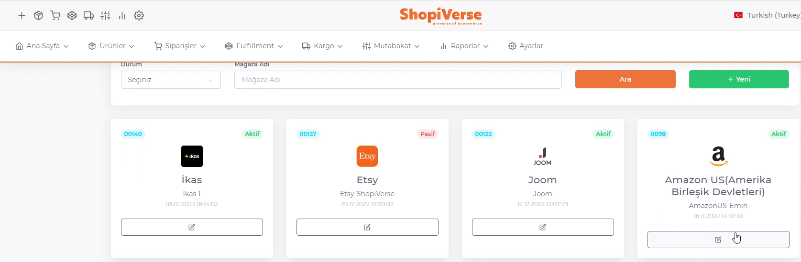
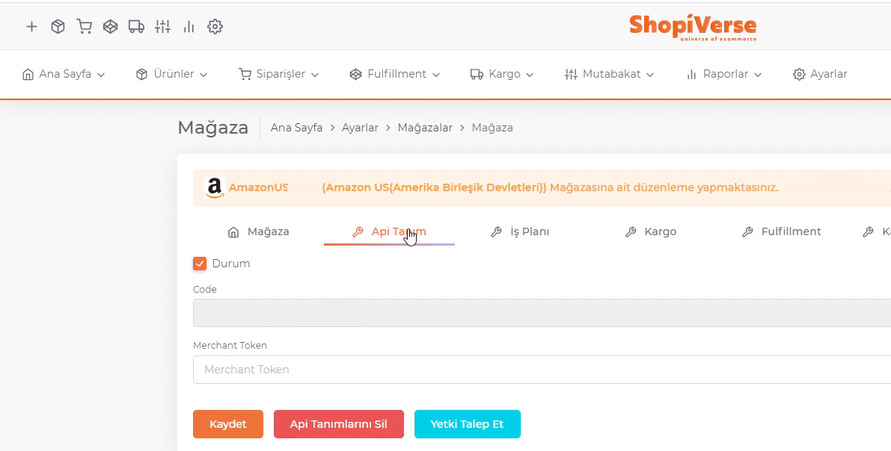

# Amazon API Entegrasyonu

**Amazon** API entegrasyonu için; ShopiVerse panelinden **Ayarlar > Mağazalar > Fruugo >  API Tanımı** alanı altındaki “**Merchant Token**” alanını doldurmamız gerekiyor. 

## Ayarlar

 
## Mağazalar > Amazon

## Amazon > API Tanımı

## Merchant Token Almak İçin

Merchant Token Almak İçin
https://sellercentral.amazon.com/hz/sc/account-information sayfasında “**Business Information > Merchant Token**” alanına girerek bu bilgiyi ShopiVerse panelindeki ilgili alana girmemiz gerekiyor. 

Daha sonra “*Durum*” kısmını tikleyerek “*Kaydet*” diyoruz ve sayfa yeniden yüklendiğinde oluşacak “**Yetki Talep Et**” butonu ile Amazon paneline giderek kullanıcı girişi yapıp, istenilen bilgilere izin veriliyor ve Amazon ile api entegrasyon bağlantımız tamamlanmış oluyor. 

:::caution

Not: Her amazon ülkesi için ayrı bir entegrasyon yapılması gerekiyor, dolayısıyla bu api tanımlarını doğru pazaryeri özelinde yapılması çok önemlidir. 

:::
