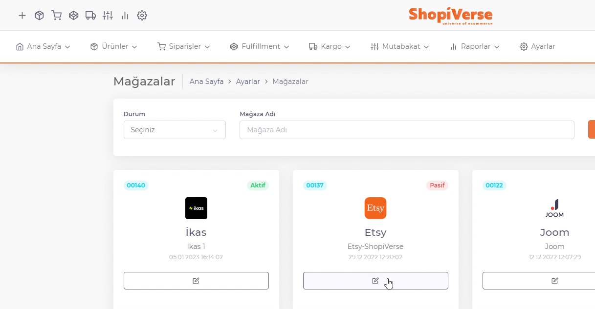

# Etsy API Entegrasyonu

**Etsy** API entegrasyonu için; ShopiVerse panelinden **Ayarlar > Mağazalar > Etsy >  API Tanımı** alanı altındaki `Durum` kısmını tikleyip, **Mağaza adı** kısmına da **Etsy mağazanızın adını birebir aynı olacak şekilde** girerek “**Kaydet**” butonuna tıklayıp daha sonra sayfa yeniden yüklendiğinde oluşacak “**Yetki Talep Et**” butonu ile *Etsy paneline giderek kullanıcı girişi* yapıp, istenilen bilgilere izin veriliyor ve Etsy ile api entegrasyon bağlantımız tamamlanmış oluyor. 

## Ayarlar

 
## Mağazalar > Etsy

## Etsy > API Tanımı

:::caution
Not: **Mağaza adı** kısmına **Etsy mağazanızın adını birebir aynı olacak şekilde** girerek “**Kaydet**” butonuna tıklayın ve istenilen bilgilere izin verin.
:::