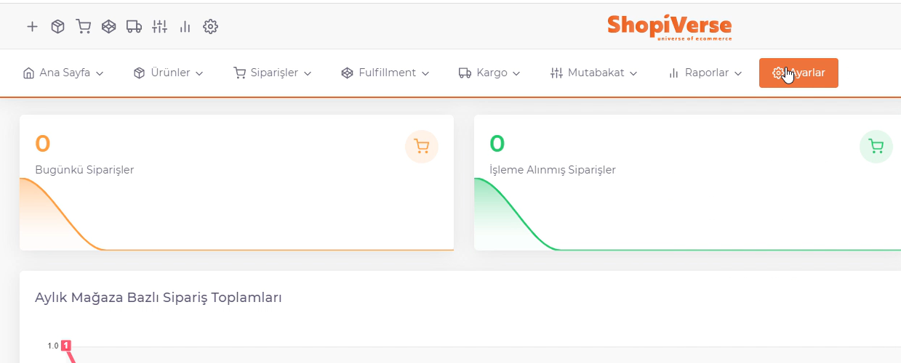
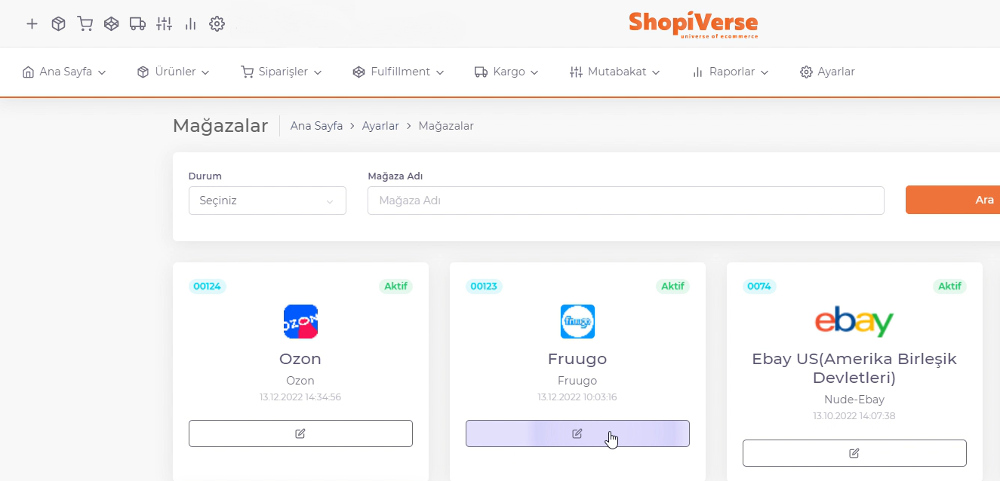

# Fruugo API Entegrasyonu

**Fruugo** API entegrasyonu için; ShopiVerse panelinden **Ayarlar > Mağazalar > Fruugo >  API Tanımı** alanı altındaki “`Kullanıcı Adı`” ve “`Şifre`” bilgilerinizi girerek sipariş entegrasyonunu sağlıyoruz.

## Ayarlar

 
## Mağazalar > Fruugo

## Fruugo > API Tanımı

**Ürün gönderim, stok fiyat güncellemeleri** için ise kategori eşleştirmeleri yapıldıktan sonra feed gönderimi yaparak ürünlerimizi Fruugo’ya aktarıyoruz. 

:::caution

Not: Burada ilk ürün gönderimlerini yapabilmek için; pazaryeri hesap açılışı yapılırken “Number of products to list on Fruugo” alanına kaç sku girildiyse bu rakamın en az %50’si kadar olacak şekilde ürün aktarımı yapılmasını istiyorlar. Buna göre işlem sağlamanız gerekmektedir. 

:::

