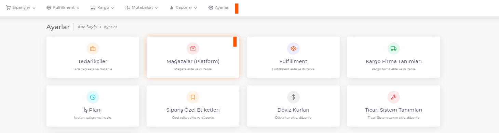
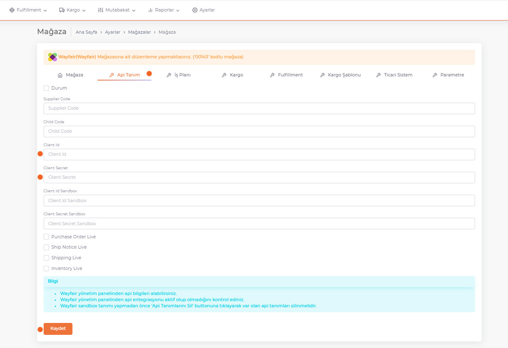

# Wayfair API Entegrasyonu

https://partners.wayfair.com/developer/applicatons adresine gidilir , "**New application**" basılır. Açılan alanda istenilen bilgiler doldurulur. **Name** alanına “**ShopiVerse**” yazılır. **Description** alanına kısa bir açıklama yazılır. **Sendbox** aktif olarak seçilir. Alanlar doldurulup onaylandıktan sonra ekranda **Client Id ve Client Secret** bilgileri görünür. **Client Id ve Client Secret** bilgileri, **ShopiVerse mağaza ayarlarında Api Tanım** sekmesine kaydedilir.

## Wayfair

## Client ID - Client Secret

