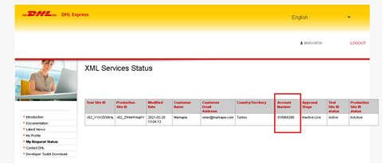
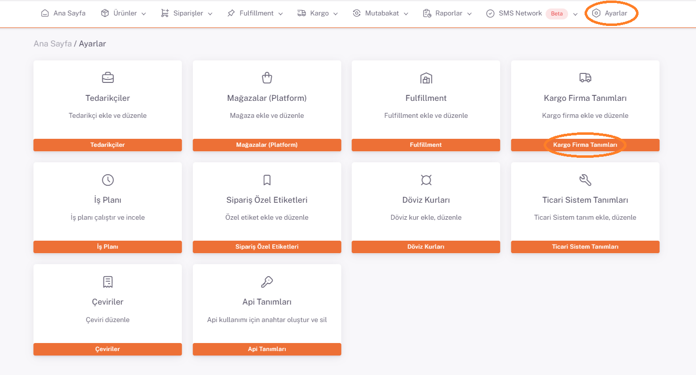
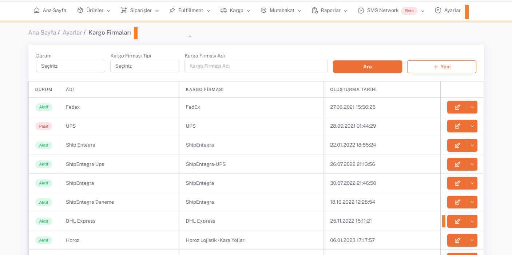

# DHL Entegrasyon

## Kullanıcı Adı - Şifre

**Kullanıcı Adı ve Şifre** bilgisi Dhl Ekibi tarafından **SiteId ve Password** olarak size verilir.

https://xmlportal.dhl.com/userCustomerListing linki üzerinden **Dhl Hesap Numarası**na ulaşılabilir.

Bu bilgiler ve gönderici ile ilgili diğer özel bilgiler ( ad, soyad vs.) **ShopiVerse > Ayarlar > Kargo Firma Tanımları**  ayarlarında parametre olarak eklenir.

Aşağıdaki panelde kullanıcı bilgilerini ve Sistemden aldığınız **Kullanıcı Adı , Şifre , Dhl Hesap Numarası** doldurup **Kaydet Butonu**na tıklıyoruz.

 