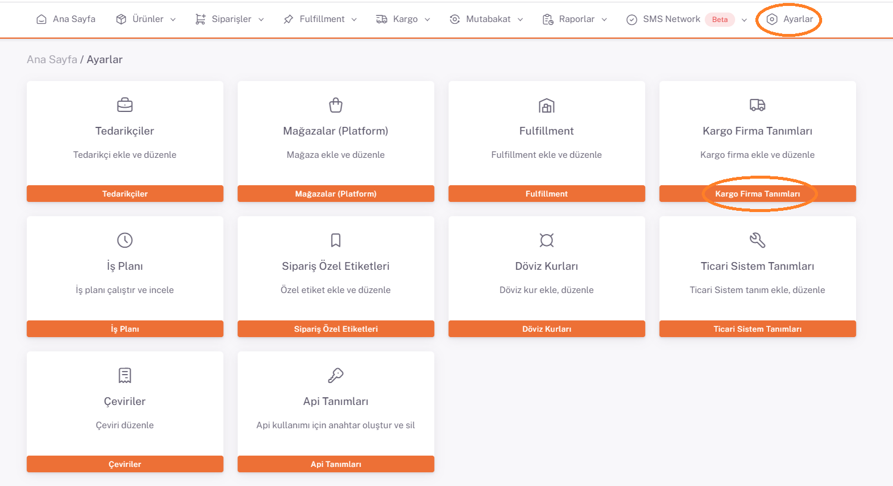
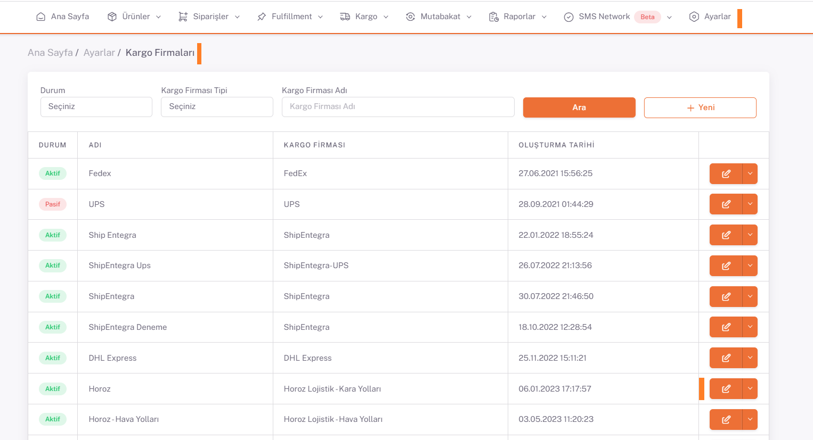
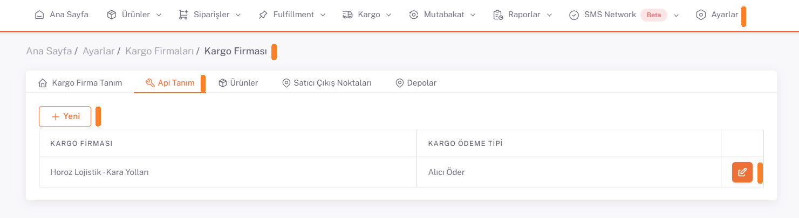
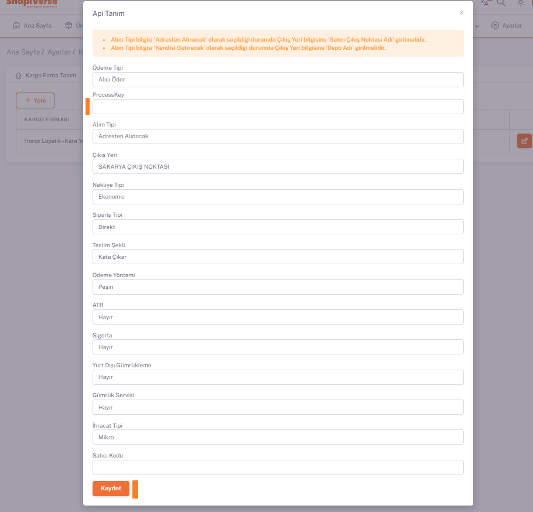

# Horoz Lojistik-Karayolları Entegrasyon

**[Kargo Firma Tanımı Ekle](/docs/dashboard/dashboard-tutorial/settings/cargo)** Sekmesinden Horoz Lojistik - Kara Yolları Kargo tanımı yapılır.

**Shopiverse > Ayarlar > Kargo Firma Tanımları** panelinde **Ekle** veya Kargo Firması eklenmiş ise **Düzenle** butonu ile **Apı Tanımı** seçilir.

## Api Tanımı > Düzenle

**Horoz Lojistik**’ten alınan **Process Key** bilgisi ShopiVerse paneline parametre olarak tanımlanır. 

**Process Key** ile birlikte diğer bilgilerin de doldurularak kaydedilmesi yeterlidir. 

:::caution
**Sipariş bildirimi** için gerekli olan diğer tüm parametrelerin de tanımlanması zorunludur (**alım tipi, çıkış yeri vs**). 
:::
 