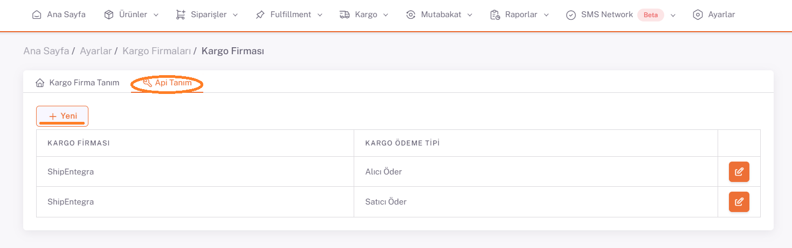
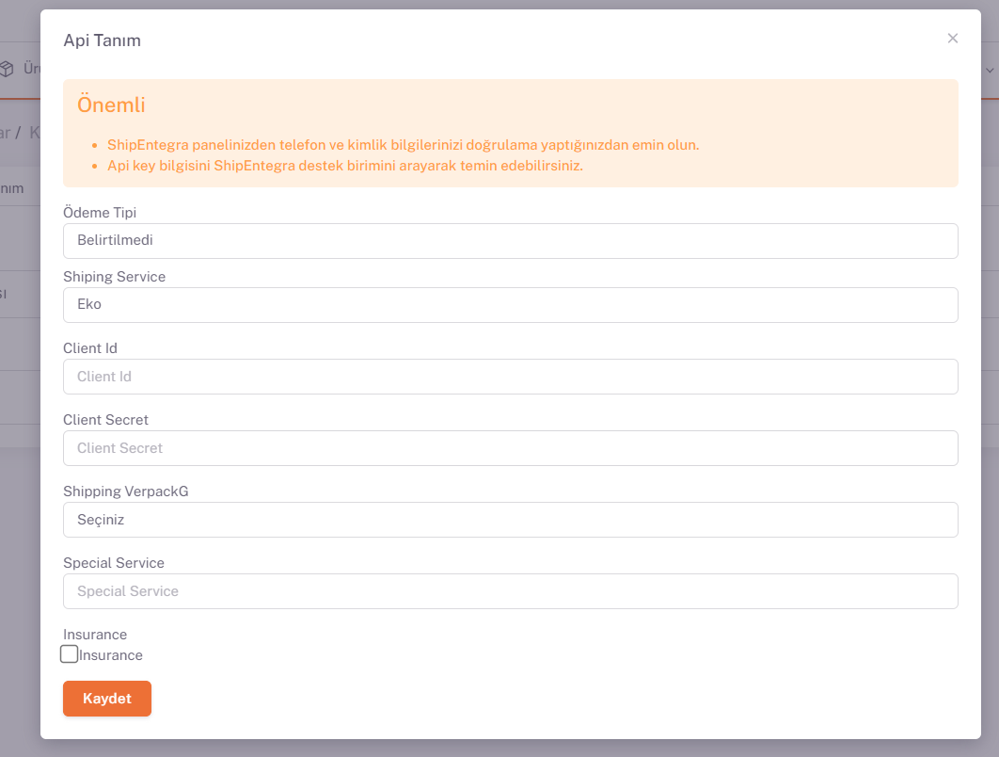

# ShipEntegra Entegrasyon

Api Tanım sekmesinde kargo firması ve ShopiVerse entegrasyonunu sağlayacak olan bilgiler tanımlanır. 

**"Yeni"**veya **"Düzenle"** butonuna basılarak açılan ekranda kargo ödemelerinin kim tarafından yapılacağını belirleyen (alıcı veya satıcı) Ödeme Tipi bilgisi seçilir. 

ShipEntegra’dan alınan **Api Key** bilgisi tanımlanır. 

Fatura için gerekli olan diğer bilgiler doldurulur ve kaydedilir. 

:::caution
ShipEntegra panelinizden **telefon ve kimlik bilgilerinizi doğrulama** yaptığınızdan emin olun.
**Api key** bilgisini **ShipEntegra destek birimini** arayarak temin edebilirsiniz.
:::

 