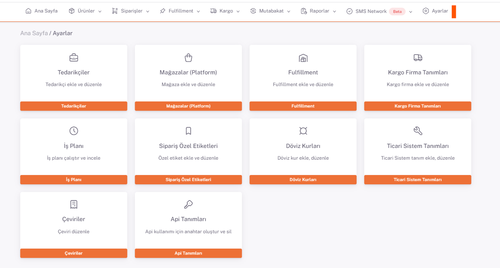
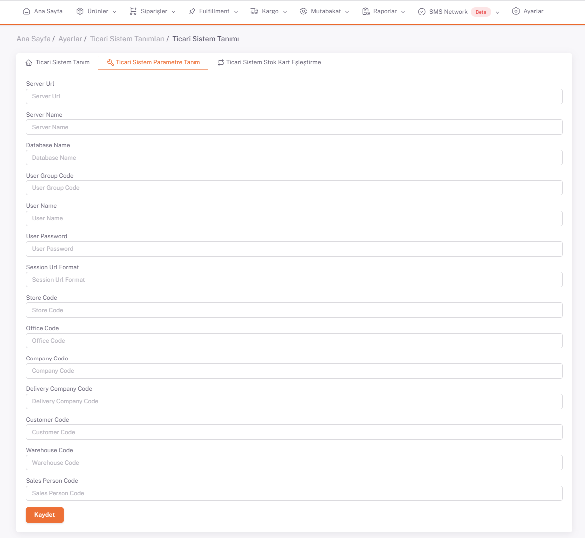

# NebimV3 Entegrasyon

**ShopiVerse Panel > Ayarlar > Ticari Sistemler** Ekranına giderek kayıtlı Ticari Sistemleri listeleyebilirsiniz. 

:::caution
Listede **Ticari Sisteminiz** bulunmuyorsa yeni Ticari Sistem tanımlamayı **[Ticari Sistem Tanımları](/docs/dashboard/dashboard-tutorial/settings/commercial-system/)**'ndan yapabilirsiniz.
:::

**Düzenle** butonu ile **Ticari Sistem Parametre Tanım** sekmesinde gerekli bilgileri ***NebimW3 Yetkililerinden*** alıp doldurarak kaydedebilirsiniz.

