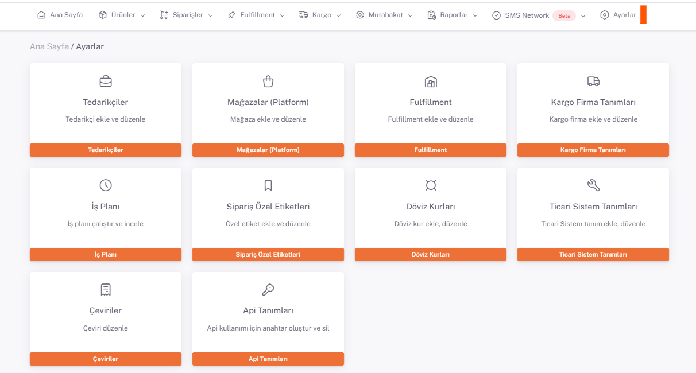
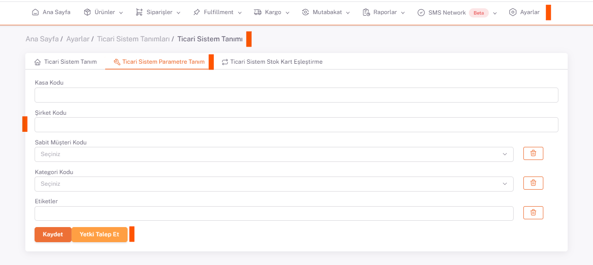

# Paraşüt Entegrasyon

## Firma Bilgileri

**Paraşüt** panelinde **Ayarlar> Firma Bilgileri** ekranına gidilir.

Firma bilgileri ekranındayken **url** adresinde görüntülenen numara şirket kodudur.

:::caution
Listede **Ticari Sisteminiz** bulunmuyorsa yeni Ticari Sistem tanımlamayı **[Ticari Sistem Tanımları](/docs/dashboard/dashboard-tutorial/settings/commercial-system/)**'ndan yapabilirsiniz.
:::

Url üzerinden alınan numara, **ShopiVerse > Ayarlar > Ticari Sistem Tanımı** *Ticari Sistem Parametre Tanım* sekmesinde **Şirket Kodu** alanına kaydedilir.

ShopiVerse panelde Kasa Kodu alanının doldurulmasına gerek yoktur. Sabit Müşteri Kodu, Kategori Kodu ve Etiket alanları zorunlu değildir. 

“**Yetki talep et**” butonun basılarak açılan sayfada Paraşüt bilgileri ile giriş yapılır. “**Yetki talebi doğrulandı**” uyarısı verildiyse işlem tamamlanmıştır.

 