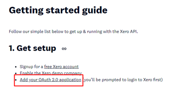
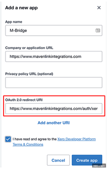
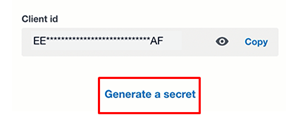
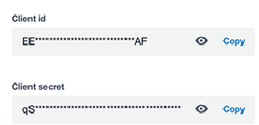
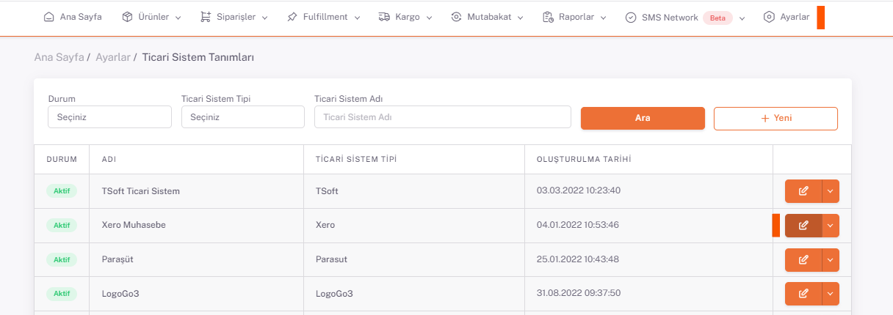
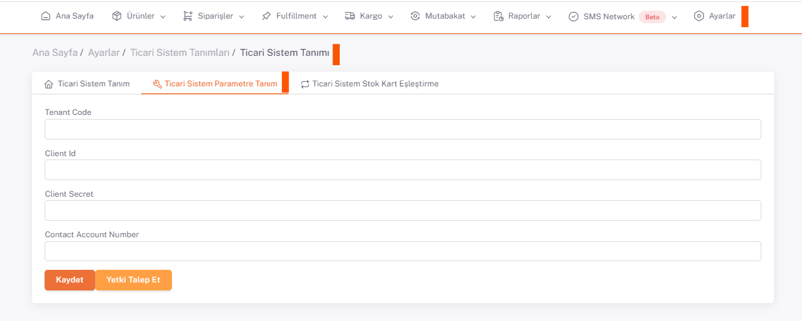

# Xero Entegrasyon

## Client ID - Client Secret

https://developer.xero.com/documentation/getting-started-guide/  (bu link üzerinde entegrasyon adımları ile ilgili detaylı bilgi mevcut.)

**Add your application** linkine tıklanarak açılan ekrandan Client Id ve Client Secret bilgileri talep edilir.

Form doldurularak **Create App** butonuna basılır. 

**App Name** : *ShopiVerse* , **Company Url** : *https://app.shopiverse.tech*  ,  **Redirect Url**: *https://app.shopiverse.tech/tr/settings/commercialsystem/xeroaccept* 

Kayıt işleminden sonra böyle bir ekran görüntülenir.

**Generate a Secret** butonuna basılarak detay bilgi görüntülenir.

## Ticari Sistem Tanımları

Buradan kopyalanan **Client Id ve Client Secret** bilgileri, **ShopiVerse > Ayarlar > Ticari Sistem Ayarlar > Parametre Tanım** sekmesine kaydedilir.

Daha sonra tekrar Xero paneline giriş yapılır. **Accounting** butonu üzerinden hesap detaylarına gidilir.

Hesap detaylarında bulunan **Account Number** alanındaki değer kopyalanarak yine **ShopiVerse parametrelerine** kaydedilir.

:::caution
Xero panelindeki **Account Number** bilgisi boş ise doldurularak kayıt edilmelidir.
:::

