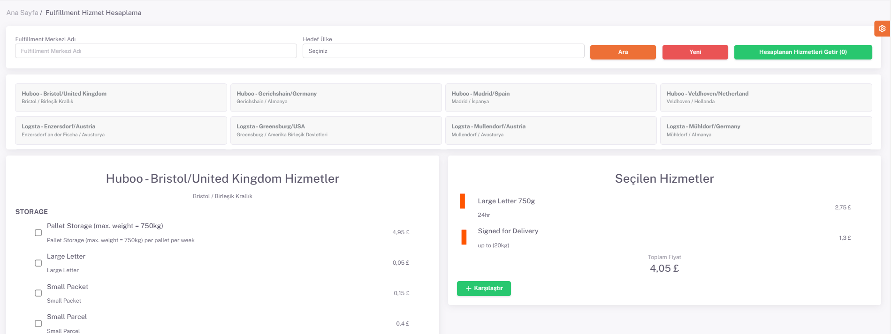

# Fulfillment Hizmet Hesaplama

**ShopiVerse Panel > Fulfillment > Fulfillment Hizmet Hesaplama** ekranında fulfillmenta ait hizmetlerin fiyat hesaplaması yapılır ve birden fazla fulfillmentın fiyat değerlerinin karşılaştırılabilmesi sağlanır. 

Öncelikle **hizmet hesaplaması** yapılmak istenen fulfillment seçilir. 

Seçim yapıldıktan sonra fulfillmenta ait hizmetler fiyatlarıyla birlikte listelenir. 

Bu listeden hesaplanmak istenen hizmetler seçilerek "**Seçili Olanları Ekle**" butonuna basılır. 

"**Seçilen Hizmetler**" başlığı altında seçilen hizmetler ve hizmet fiyatları listelenir. Hizmetlere ait toplam fiyat da hesaplanmıştır. 

Hesaplanan bu toplam fiyatı, başka fulfillment hizmetleri ile karşılaştırmak için "**Karşılaştır**" butonuna basılır. 

Açılan "**Hesaplanan Hizmetler**" ekranında şu an ve daha önce hesaplanan fulfilment hizmet toplamları görünmektedir. 

Bu şekilde farklı fulfillmentların hizmet fiyatları karşılaştırılabilir. 

"**Hesaplanan Hizmetleri Getir**" butonuna basılarak da daha önce karşılaştırılan değerler görüntülenebilir. 