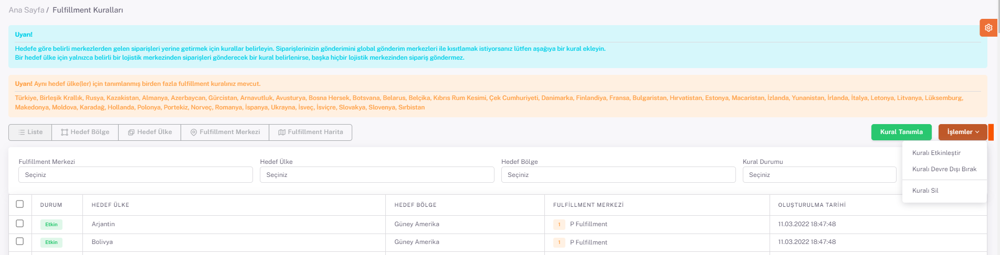

# Fulfillment Kuralları

Birden fazla **fulfillment** ile çalışıldığı durumda, bu fulfillmentlar için **kural tanımlamal**arı yapılır. 

Kural tanımlanmasının amacı belirli bölgelerden gelen siparişlerin gönderim yapılacağı deponun otomatik olarak seçilip, o depodan çıkışının yapılmasını sağlamaktır. 

***Kural tanımlamak için***, 

**Shopiverse panel > Fulfillment > Fulfillment Kuralları** ekranında “**Kural Tanımla**” butonuna basılır. 

**Açılan ekran**daki alanlar doldurularak **kural tanımı** yapılır. 

**Fulfilment Merkezi**, kural tanımı yapılmak istenen depo olarak seçilir. 

*Hedef Ülke* ve *Hedef Bölge* seçilir.  

**Kural Durumu**, “Etkin” veya “Devre Dışı” olarak seçilir. 

Öncelik sırası da doldurularak kaydedilir. 

**Kural tanımı** tamamlanmıştır ve durumu “**Etkin**” olarak seçildiyse, hedef bölge ve ülkeden gelen bir sipariş olduğunda öncelik sırasına bakılarak, sipariş seçilen fulfillment merkezine yönlendirilecektir. 

Durumu “**Devre Dışı**” olarak seçildiyse, hedef bölge ve ülkeden gelen bir sipariş olduğunda, seçilen fulfillment merkezine yönlendirilmesinin istenmediği anlamına gelmektedir. 

“***Hedef Bölge***” butonuna basılarak açılan sayfada tanımlanan kurallar, hedef bölgelere göre gruplanmış şekilde listelenmektedir. 

“***Hedef Ülke***” butonuna basılarak açılan sayfada tanımlanan kurallar, hedef ülkelere göre gruplanmış şekilde listelenmektedir. 

“***Fulfillment Merkezi***” butonuna basılarak açılan sayfada tanımlanan kurallar, fulfillment merkezlerine göre gruplanmış şekilde listelenmektedir. 

“***Fulfillment Harita***” butonuna basılarak açılan sayfada tanımlanan kurallar, harita üzerinde gösterilmektedir. 

Fulfillment seçimi yapılarak, bu fulfillmenta ait hangi bölgeler için kural tanımı yapıldığı harita üzerinde görüntülenir. 

