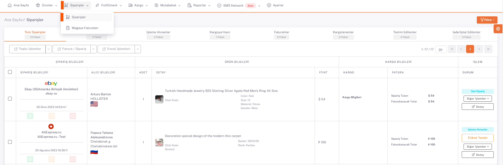
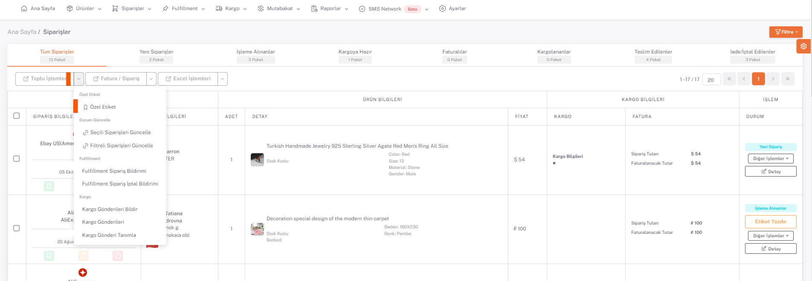
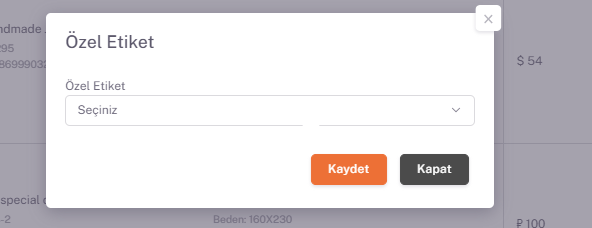
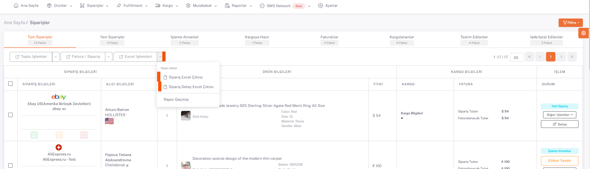

# Siparişler

**ShopiVerse Panel > Siparişler** sayfasında tüm siparişler bulunmaktadır.

:::caution
**Platformlardan gelen siparişlerin** ShopiVerse paneline yansıması için öncelikle iş planının çalıştırılması gerekmektedir. 
**ShopiVerse Panel > Ayarlar > İş Planı** ekranından ilgili platform altında listelenen "Pazaryeri Siparişi Getir" iş planı çalıştırılır. 
Bu iş planı otomatik hale getirilerek düzenli olarak siparişlerin çekilmesi sağlanabilir.
:::

 

Siparişlere toplu olarak **[Özel Etiket](/docs/dashboard/dashboard-tutorial/settings/order-private-label)** tanımlanabilir. Özel etiket eklenmek isteyen siparişler seçilir. 

**Toplu İşlemler > Özel Etiket** butonuna basılarak açılan ekranda daha önce tanımı yapılan etiketlerden seçilerek kaydedilir. 

 

## Excel İşlemleri

**Siparişlerin çıktısı** excel olarak dışarı aktarılabilir. **Excel İşlemleri > Sipariş Excel Çıktısı** butonuna basılarak siparişlerin dışarı aktarımı başlatılır.

**Excel İşlemleri > Sipariş Detay Excel Çıktısı** butonuna basılarak siparişlerin içerdiği ürün kalemleri ile birlikte dışarı aktarımı başlatılır. 

**Rapor Geçmişi** sayfasından excelin durumu görüntülenir. "*Tamamlandı*" durumuna geçtiğinde sipariş exceli indirilebilir durumdadır. 

**Sonuç Dosyası** butonuna basılarak excel indirilir. 