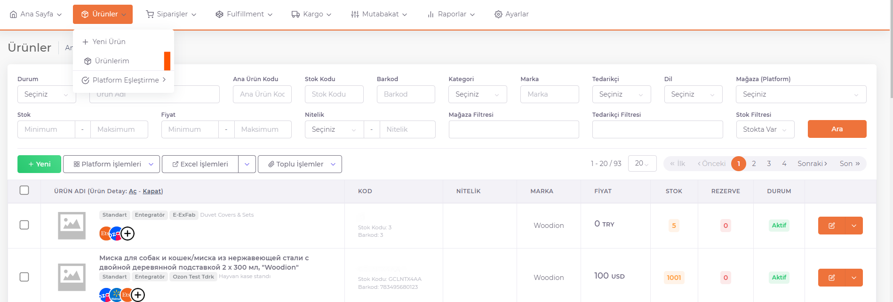
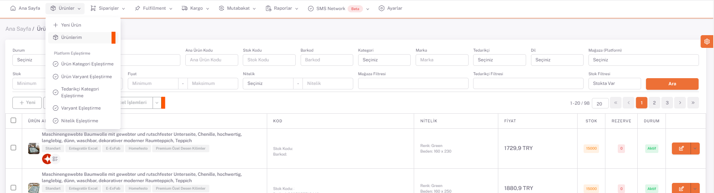
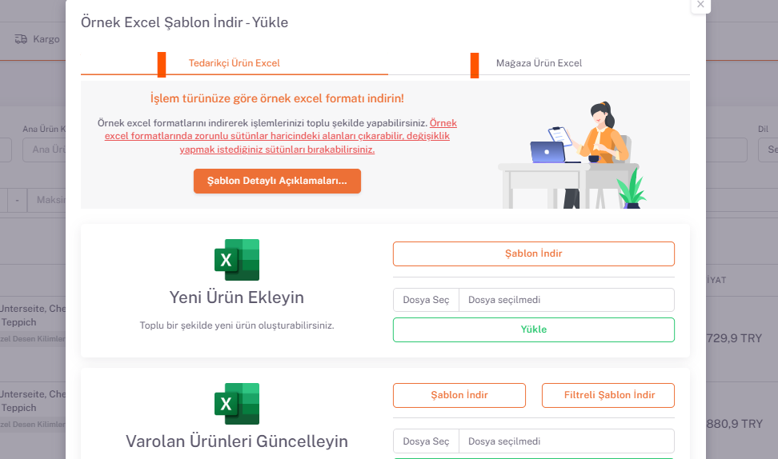

# Ürünlerim
**ShopiVerse Panel > Ürünler > Ürünlerim** Ekranında tüm ürünler listelenir. **Ürün filtreleme , yayınlama , ekleme , silme ve düzenleme** işlemleri bu ekranda yapılır.

## Ürünlerin Yüklenmesi

**Ürünler** bir kaynak üzerinden çekilebilir veya excel yoluyla manuel olarak içeri aktarılabilir. 

### Excel İle Ürün Yükleme 

**ShopiVerse Panel > Ayarlar > [Tedarikçiler](/docs/dashboard/dashboard-tutorial/settings/suppliers/new-supplier)**  ekranından tedarikçi tanımı yapılır. Buradaki "**Tedarikçi Adı**" excele yazılacaktır.

**ShopiVerse Panel > Ürünler > Ürünlerim > Excel İşlemleri** butonuna basılır.

**Yeni Ürün Ekleyin > Şablon İndir** butonuna tıklayarak mevcut şablon indirilir. 

Doldurulan excel "**Yeni Ürün Ekleyin**" alanından “**Dosya Seç**” butonuna basılarak seçilir ve “**Yükle**” butonuna basılarak yüklenir. 

:::caution
Şablon üzerindeki renkli olarak gösterilen sütunlar **zorunlu alanlar**dır ve kesinlikle doldurulması gereklidir. 
"**Şablon Detaylı Açıklamaları**" butonundan indirilen excelde daha detaylı bilgi mevcuttur. 
:::

**ShopiVerse Panel > Raporlar > Rapor Geçmişi** sayfasından excelin durumu görüntülenir. "***Tamamlandı***" durumuna geçtiğinde ürünlerin içeri aktarımı bitmiştir. 

## Excel İşlemleri

**Ürünler > Ürünlerim > Excel İşlemleri** butonuna tıklandığında açılan sayfada iki tane sekme bulunmaktadır. 

**Tedarikçi Ürün Excel** sekmesinde bulunan işlemler tedarikçi ürün bilgilerinde değişiklik yapmak için kullanılır. 

**Mağaza Ürün Excel** sekmesinde bulunan işlemler ise mağazaya eklenmiş ürün bilgilerinde değişiklik yapmak için kullanılır. Burada yapılan değişiklikler tedarikçi bilgilerini etkilemez fakat platformlara ürünler gönderilirken öncelikli olan mağaza ürün bilgileridir. 

:::caution
Mağaza ürün bilgileri boş olduğu durumda tedarikçi ürün bilgileri baz alınır. 
:::

