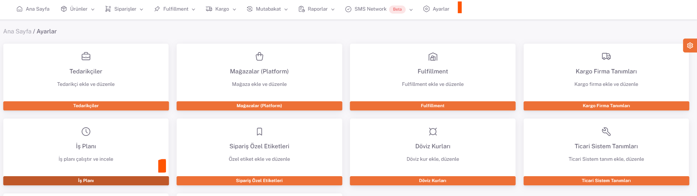
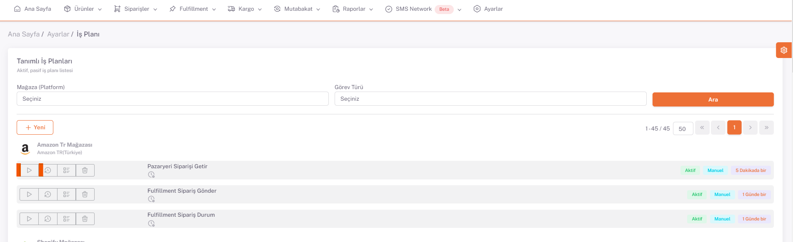

# İş Planı

**İş planları**, ShopiVerse paneli ve platformlar arasındaki veri akışını sağlamak için tetiklenmesi gereken *görevlerdir*. 

İş planlarını görüntülemek **ShopiVerse Panel > Ayarlar > İş Planı** ekranına gidilir. 

Tüm **iş planları detayları**yla birlikte burada görünmektedir. Her platform altında, platform için gerekli olan iş planları listelenmektedir. 

(İş planları, **ShopiVerse Panel > Ayarlar > Mağazalar > İş Planı Ayarları** ekranından **Aktif-Pasif** ve **Otomatik-Manuel** olarak ayarlanmaktadır.) 

İş planını çalıştırmak için "**Çalıştır**" butonuna basılır. 

İş planının detayına erişmek için "**İş Plan Geçmişi**" butonuna basılır. Burada iş planı çalışırken oluşan hatalar, uyarılar, yapılacak işlemler gibi konularda bilgi verilir. 