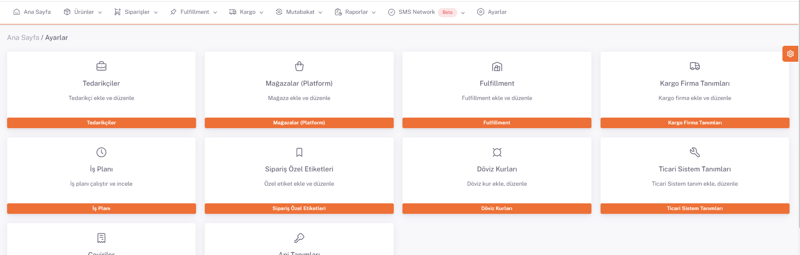
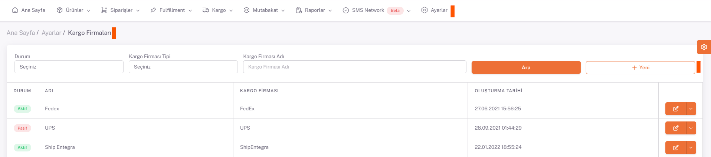
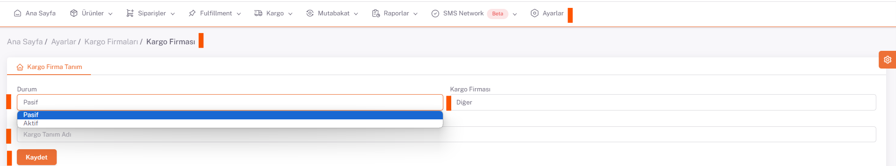

# Kargo Firma Tanımları

Yeni bir kargo firma tanımı yapmak için **Ana Sayfa > Ayarlar > Kargo Firma Tanımları** ekranına gidilir. 

**"Yeni"** *butonuna* basılarak açılan sayfada yeni kargo firma bilgileri girilerek kayıt işlemi yapılır. 

**Kargo firması**nın **aktif** veya **pasif** olma durumuna bağlı olarak durum bilgisi seçilir. 

*Çalışmak istenilen Kargo Firması* seçilir ve *tanımlanan kargo firmasına verilmek istenen* isim **Kargo Tanım Adı** alanına doldurularak kaydedilir.

:::caution
Açılan ekranda **Api Tanım** sekmesinde **kargo firması ve ShopiVerse entegrasyonunu sağlayacak** olan bilgiler tanımlanır.
**[Kargo Entegrasyonları](/docs/category/kargo-entegrasyon)** Sayfasından Apı Tanımı yapabilirsiniz.
:::