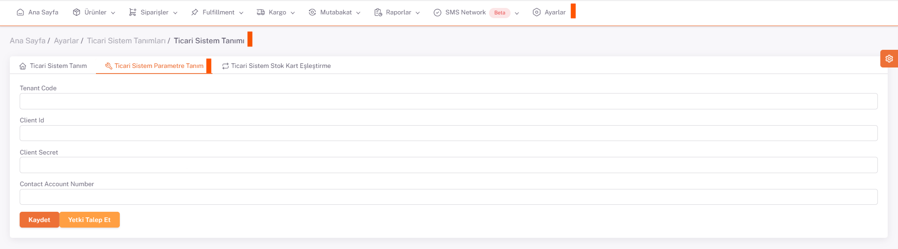

# Ticari Sistem Tanımları

Yeni bir ticari sistem tanımı yapmak için **ShopiVerse Panel > Ayarlar > Ticari Sistem Tanımları** ekranına gidilir. 

 

“**Yeni**” butonuna basılarak açılan sayfada yeni ticari sistem bilgileri girilerek kayıt işlemi yapılır.

 

**Durum bilgisi** ***Aktif/Pasif***  seçilir. **Ticari Sistem Tipi** ***Çalışacağınız Ticari Sistem ismi*** olarak seçilir. Adı alanına da ticari sisteme verilmek istenen isim doldurularak kaydedilir. 

Açılan ekranda “**Ticari Sistem Parametre Tanım**” sekmesinde **ShopiVerse ve Çalışacağınız Ticari Sistemin** entegrasyonu için doldurulması gereken alanlar vardır. 

:::caution
Bu Alanları [Ticari Sitem Entegrasyonlarında](/docs/category/ticari-sistem-entegrasyonu) bulabilirsiniz.
:::
