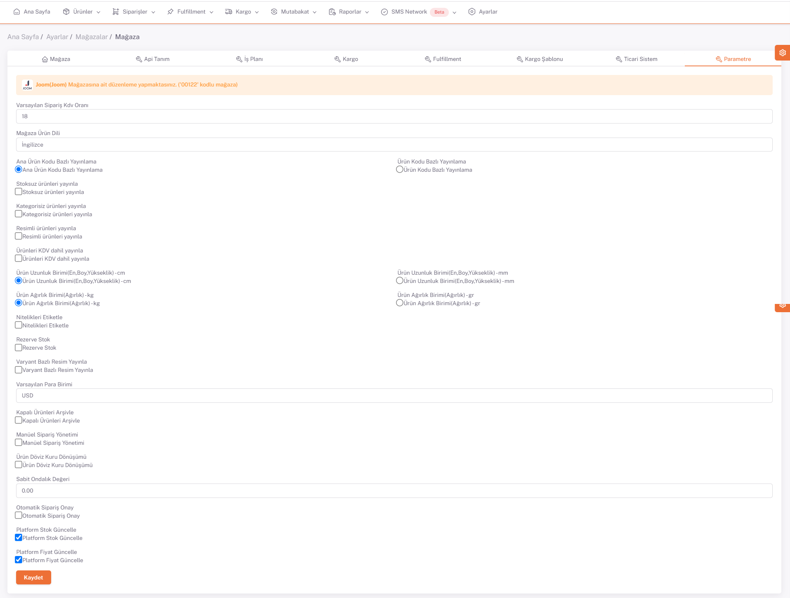

# Parametre

**Varsayılan KDV oranı** mağaza bazında kdv vergi oranı ,

**Mağaza ürün dili** platfomda yayınlanan ürün dilini ,

**Ana ürün kodu** bazında model kodu çoğul ürün alır ve temel ürüne göre gruplandırma yapar ,

**Ürün Kodu** ana ürün kodunun alt varyantını gösterir ,

**Stok Kodu** ürün için özel tekil kod etikete yazılan kod ,

**Stoksuz Ürünleri Yayınla** Stok olmayan ürünleri yayınlamayı sağlıyor (shopify etsy stok olmayan ürünleri yayınlatıyor platformlar stok denetimi yapıyor),

**Kategorisiz Ürünleri Yayınla** Ürünleri Kategorize etmiyor Etiket ile grupluyor (Shopifyda gecerli) ,

**Resimli Ürünleri Yayınla** Resimli olan ürünler filtrelenir ve yayınlanır ,

**Ürünleri KDV Dahil Yayınla**  Ürünleri vergilendirme dahil yayınlar ,

**Nitelikleri Etiketleme** nitelikleri etikete eklemek için ,

**Rezerve Stok** rezerve edilen ürün stoğu tutulabilir ,  

**Varyant Bazlı Resim Yayınlama** ürünlerin varyantını resimlendirir (ozon shopify için geçerli) ,

**Kapalı Ürünleri Arşivle** shopify ürün stok 0 olunca arşive çekiyor ve stok gelince tekrar ekrana alıyor ,

**Manuel Olarak Sipariş Yönetimi** sistemi manuelleştirmek ve elden takip etmek için kullanılır ,

**Ürün Döviz Kuru Dönüşümü** tedarikçi para birimini satış para birimine çevirir ,

**Sabit Ondalıklı Değeri**  fiyat sonuna girilen sabit ondalıklı sayıyı ekler ,

Mağazaya özel parametre tanımı buradan yapılır. 

Parametreler, mağaza üzerinde işlem yapılırken baz alınan değerlerdir. 