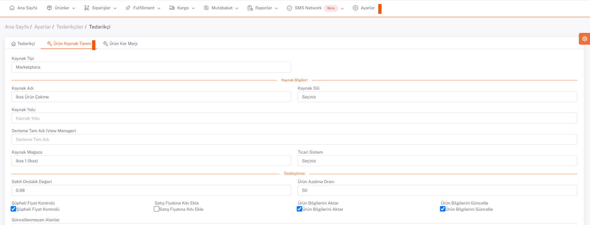
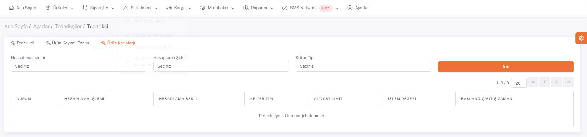

# Yeni Tedarikçi Ekleme

**Tedarikçi**, sisteme girilmek istenen ürünlerin kaynağını ifade eder.  
Yeni bir **tedarikçi tanımı** yapmak için ***ShopiVerse Panel > Ayarlar > Tedarikçiler*** ekranına gidilir.

"**Yeni**" butonuna basılarak açılan sayfada yeni tedarikçi **bilgileri girilerek** kayıt işlemi yapılır. 

Tedarikçinin **aktif veya pasif** olma durumuna bağlı olarak durum bilgisi seçilir. 

**Ad ve Kod** tanımlamaları yapılır, kaynağın **hangi dil**de olduğu bilgisi seçilir. 

Daha sonra "**Kaydet**" butonuna basılarak **yeni tedarikçi** tanımı yapılmış olur.  

:::caution
Açılan ekranda “**Ürün Kaynak Tanım**” sekmesinde ürün kaynağı ile ilgili doldurulması gereken bilgiler vardır. Bu bilgiler ShopiVerse’e iletilir ve tanımlamaları ShopiVerse tarafından yapılır.  
:::