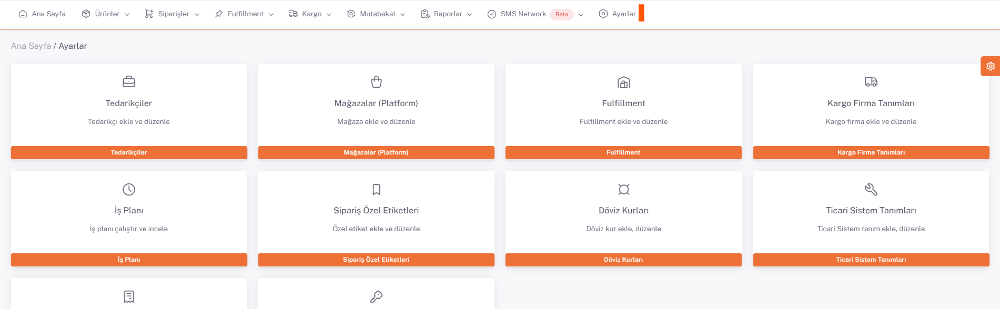
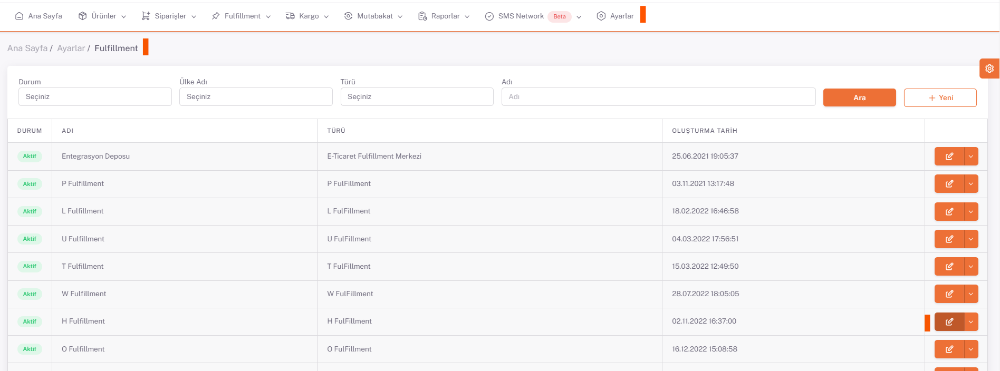
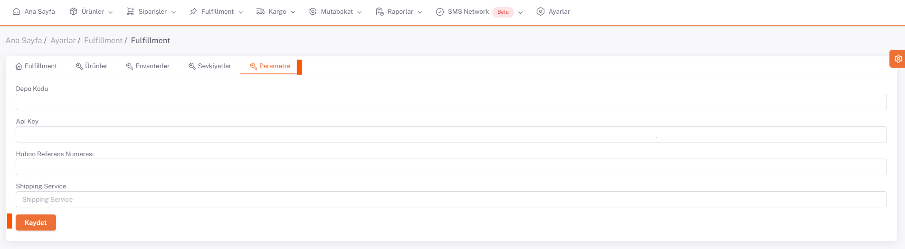

# Huboo Entegrasyon

## Ayarlar > Fulfillment

***Api key ve Ref Kodu*** , **ShopiVerse > Ayarlar > FulFillment > Parametre** olarak eklenir.
Ayrıca **Depo Kodu** parametresine ihtiyaç vardır. Bu kod ShopiVerse yazılım ekibi tarafından arka planda tanımlanır.

ShopiVerse panelinden **Ayarlar > Fulfillment** sayfası altından “**Yeni**” butonu ile fulfillment oluşturma sayfasını açılır.
Durum kısmı *Aktif* yapılır, Fulfillment Türü kısmında ise çalışılacak fulfillment’ın kodu seçilir. Fulfillment Adı kısmını ise istediğiniz şekilde isimlendirebilirsiniz. Daha sonra da ilgili fulfillment’ın adres bilgilerini ilgili alanlara yazarak Kaydet işlemi yapmanız gerekmektedir.

Daha sonra yenilenecek sayfa üzerinde “**Parametre**” sekmesine girerek istenilen bilgilerin girilmesi gerekmektedir.
*Depo Kodu*: Huboo özelinde ürünlerinizin listeleneceği depo belirlendikten sonra Huboo sistemi üzerinde tanımlanmış deponun kodudur. Bu bilgiyi Huboo ekibinden talep etmekteyiz.
*Api Key*: Huboo panelinde *https://client.huboo.uk/profile* sayfası üzerindeki “*API Keys*” alanına Key name bilgisi girerek “*Create*” diyoruz ve açılan sayfadaki Api Key’i kopyalayarak ShopiVerse panelinde ilgili alana yapıştırıyoruz.
**Huboo Referans Numarası**: Huboo panelinde Hub menüsü altında bulunan “**Huboo Ref** ***” numarasını olduğu gibi ilgili alana yazmanız gerekmektedir.
**Shipping Service**: Huboo’ya gönderilecek siparişlerde bir sipariş şablonu oluşturmak gerekmektedir, bu oluşturulan şablon isminin bu alana girilmesi gerekmektedir.

## Düzenle

## Parametre

## Huboo Hesabı

https://client.huboo.uk/register/account  linkinden Huboo hesabı oluşturulur.

https://help.huboo.uk/en/support/solutions/articles/6000254795-setup-process-for-open-api-v2-0-sandbox Bu linkte kurulum ile ilgili ayrıntılı bilgi vardır.

Hesap oluşturduktan sonra ekranın **sol tarafı**ndaki isim üzerine tıklanarak **account sayfası** açılır. **Apı Keys** altındaki **Create butonu**na basarak yeni **Api Key** alınır.

**Hub butonu**na tıklandığında **Huboo Ref Kodu** gözükür.
