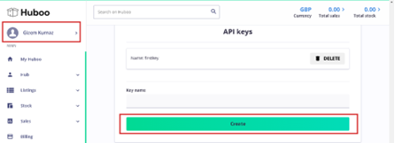
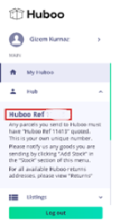

# Huboo Entegrasyon

## Huboo Hesabı

https://client.huboo.uk/register/account  linkinden Huboo hesabı oluşturulur.

https://help.huboo.uk/en/support/solutions/articles/6000254795-setup-process-for-open-api-v2-0-sandbox Bu linkte kurulum ile ilgili ayrıntılı bilgi vardır.

Hesap oluşturduktan sonra ekranın **sol tarafı**ndaki isim üzerine tıklanarak **account sayfası** açılır. **Apı Keys** altındaki **Create butonu**na basarak yeni **Api Key** alınır.

**Hub butonu**na tıklandığında **Huboo Ref Kodu** gözükür.
**Api key ve Ref Kodu** , **ShopiVerse > Ayarlar > FulFillment > Parametre** olarak eklenir.
Ayrıca **Depo Kodu** parametresine ihtiyaç vardır. Bu kod ShopiVerse yazılım ekibi tarafından arka planda tanımlanır.
