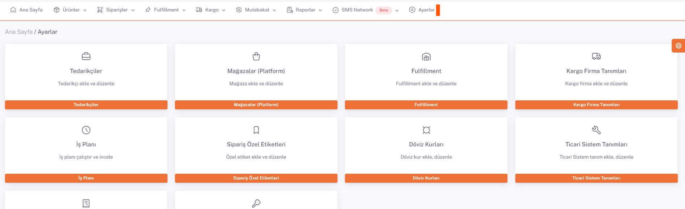
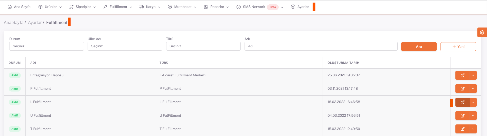
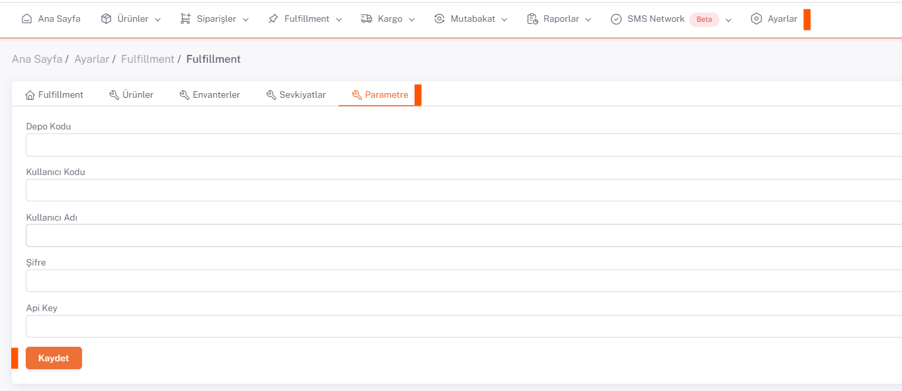

# Logsta Entegrasyon

## Api Key

***Api Key*** bilgisi Logsta tarafından alınır. (Kullanıcı oluşturulduğunda Logsta ekibi tarafından bu bilgi verilir.)

## Parametre

***Kullanıcı Adı, Şifre ve Api Key*** bilgileri, **Shopiverse > Ayarlar > Fulfillment**  *Parametre* sekmesine kaydedilir. 

:::caution
**Kullanıcı Adı ve Şifre bilgi**leri **Logsta paneline giriş** yapılırken kullanılan bilgilerdir.
:::

## Ayarlar > Fulfillment

## Düzenle

## Parametre

:::caution
Ek olarak Depo Kodu ve Kullanıcı Kodu parametrelerine ihtiyaç vardır. **Kullanıcı Adı, Şifre ve Api Key** bilgileri tanımlandıktan sonra, **Depo ve Kullanıcı kod**ları ShopiVerse yazılım ekibi tarafından arka planda tanımlanır. 
:::

 