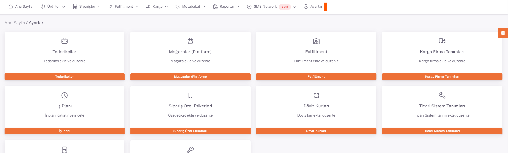
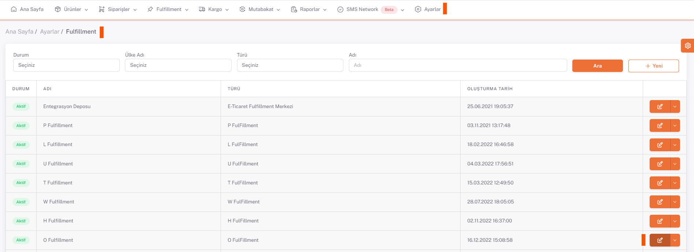
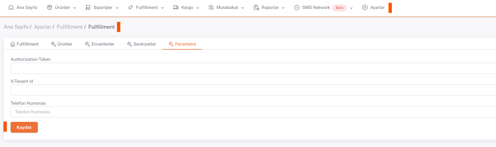
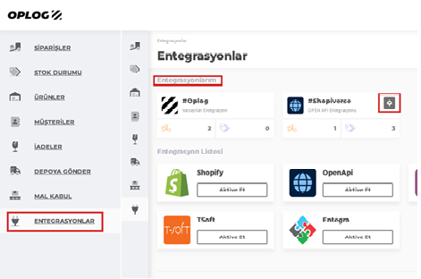
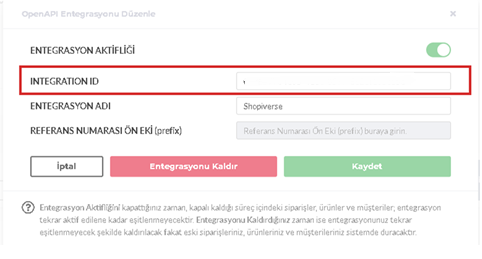

# Oplog Entegrasyon

## Parametre

**Authorization  key ,  X-Tanant Id ve Intagration Id** **Shopiverse > Ayarlar > Fulfillment**  *Parametre* olarak kaydedilir. 

## Ayarlar > Fulfillment

## Düzenle

## Parametre

:::caution
*Authorization  key  ve  X-Tanant Id* **Oplog**  ekibi tarafından size verilir.
Panelde **Entegrasyonlar ->Entegrasyonlarım -> Shopiverse** ‘ e tıklanırsa açılan ekranda **Integration Id** görünür.
:::

 