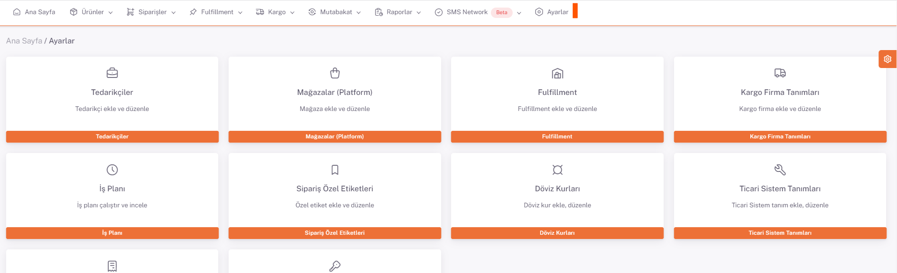
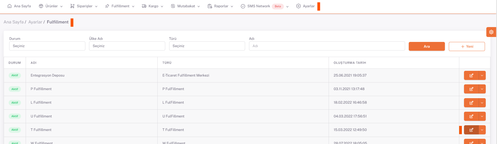
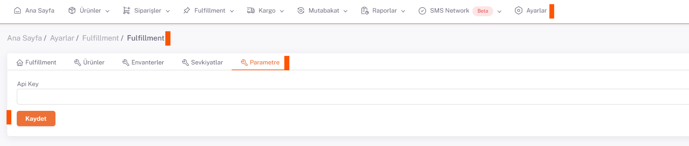

# Turland Entegrasyon

## Api Key

https://app.webshippy.com/settings/stores/add/webshippy-api url'indeki form doldurularak **Api Key** bilgisi alınır.

Form üzerinde **Store Name, Short Name ve Store Url** alanlarının doldurulması yeterlidir.

Bu alanalar doldurulup kaydedildikten sonra form üzerindeki **Api Key** alanı otomatik dolar.

Buradan alınan **Api Key** bilgisi,  **ShopiVerse > Ayarlar > Fulfillment**  *Parametre* sekmesine kaydedilir.

## Ayarlar > Fulfillment

## Düzenle

## Parametre

 