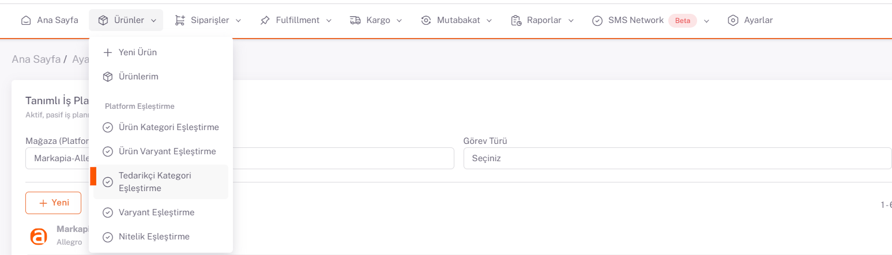
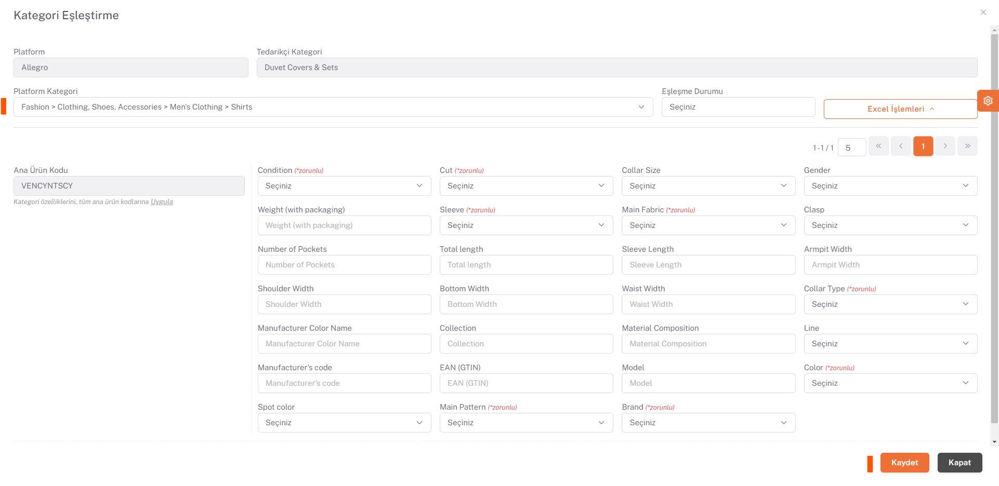

# Allegro Kategori Eşleştirme

Ürünlerim sayfasında **Allegro** özelinde satışa açılmasını istediğiniz ürünler seçilir ya da *filtrelenir*.  
## Ürünler > Ürünlerim

## Platform İşlemleri > Seçili / Filtreli Ürünleri Yayınlar
Daha sonra **Platform İşlemleri** altından “*Seçilen Ürünleri Yayınla*” ya da “*Filtreli Ürünleri Yayınla*” seçeneği seçilerek açılan pop-up sayfasında Allegro seçilir ve Kaydet yapılır.

## Kategori Eşleştirme

Daha sonra **Ürünler > Platform Eşleştirme > Tedarikçi Kategori Eşleştirme** sayfası açılır, Mağaza alanından Allegro seçilir ve aşağıda satışa açılabilir olarak seçtiğiniz ürünlerinizin kategorileri listelenir. 

## Düzenle

İlgili kategorinin sağ tarafında bulunan düzenle butonu ile kategori eşleştirme sayfasını açıyoruz. Buradaki Platform Kategori alanını Tedarikçi Kategori alanında yazan kategorinizin karşılığı olanı ya da en yakın olan kategoriyi seçmeniz gerekmektedir.

*Kategori* seçildikten sonra aşağıda *Ana Ürün Kodu* bazında ürünleriniz ve platformun istediği değer alanları listelenir. Ürünlerinizin satışa açılabilmesi için her *Ana Ürün Kodu* için karşılık gelen değerlerden “**Zorunlu**” olanları mutlaka doldurmanız gerekmektedir. Bu alanları doldurduktan sonra kaydet diyerek kategori eşleştirmelerini tüm kategori ve ürünlerde tamamlıyoruz. 

Burada diğer pazaryerlerinden farklı olarak “**Color**” eşleştirme alanında ilgili Ana Ürün Koduna ait renk varyantlarınız varsa tüm renkleri bu alanda çoklu olarak seçerek işlem yapmanız gerekmektedir. 

## Excel İşlemleri

Eşleştirmeleri tek tek yapmak istemediğiniz durumda *sağ alandaki excel işlemleri* altından “**Excel Şablonu**” indir diyerek *zorunlu değer* alanlarına excelde bulunan “**Kategori Özellikleri**” sheetindeki “**Özellik Değer Kodu**” altında yazan bilgileri *Kategori Eşleştir* sheetindeki *Ana Ürün Kodlarına* karşılık gelen sütunlarda doğru bir şekilde doldurarak kaydetmeniz gerekir. Exceli hazırladıktan sonra ShopiVerse panelinde aynı sayfa üzerinden excel işlemleri altında “**Dosya Seç**” diyerek ilgili exceli seçip “**Excel Şablonu Yükle**” diyerek yükleme işlemini sağlayabilirsiniz. 

