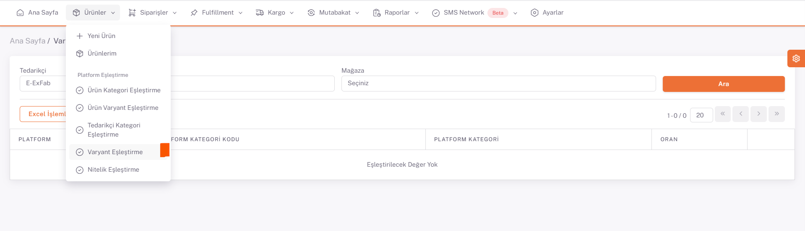
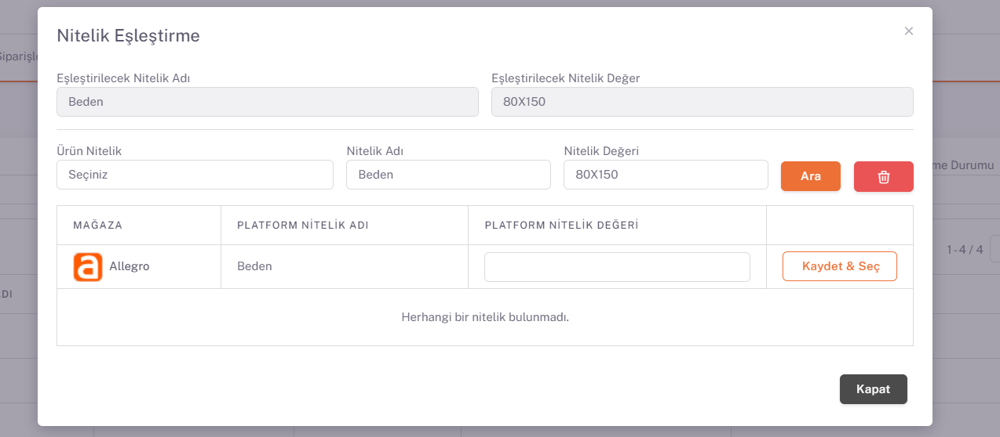

# Allegro Varyant Eşleştirme 
 
Kategori eşleştirmeleri tamamlandıktan sonra **Ürünler > Platform Eşleştirme > Varyant Eşleştirme** sayfası açılır. *Mağaza* alanından *Allegro* seçilir ve aşağıda kategori eşleştirmelerini yaptığınız kategorilerin bilgileri listelenir. 

## Varyant Eşleştirme

İlgili kategorinin **sağ tarafında** bulunan *düzenle* butonu ile varyant eşleştirme sayfasını açıyoruz. 

## Platform Nitelikleri

Buradaki **Nitelik Değeri** alanını karşılık gelen düzenle butonu ile açılan sayfada “*Temizle*” butonu ile değerleri sıfırlayıp “*Ara*” diyerek platformun sunmuş olduğu nitelik değeri karşılıklarından uygun olan seçilir ve bu her nitelik değeri için yapılır. 

Renk eşleştirmelerini kategori eşleştirme sayfasında yaptığımız için burada sadece beden eşleştirmelerini yapmamız yeterli olacaktır. 

