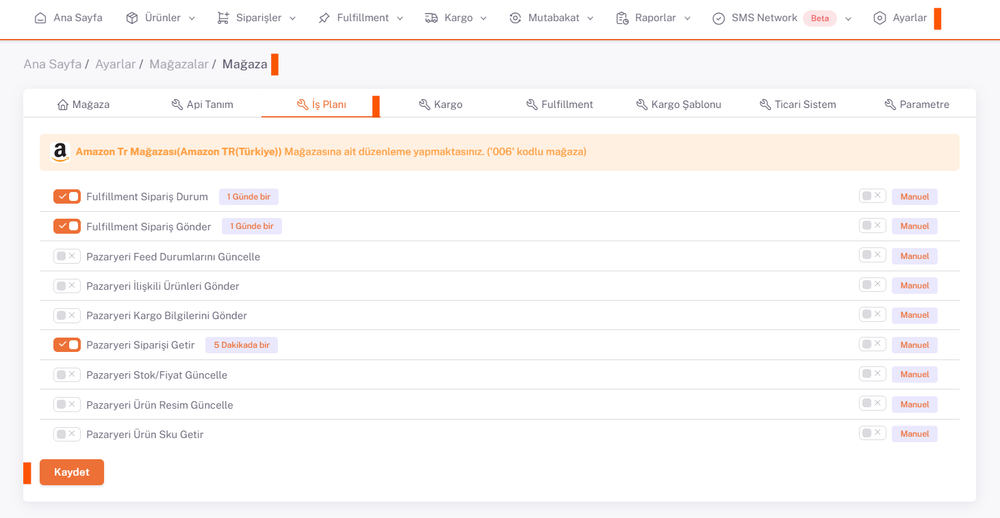
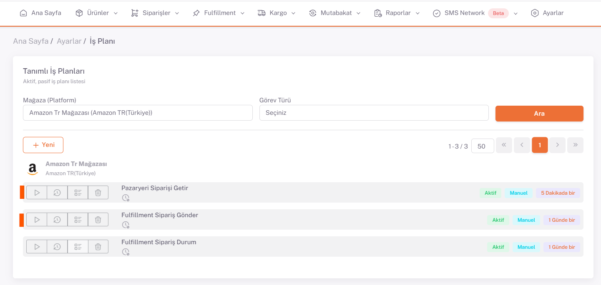

# Amazon İş Planları 

Amazon için *kategori eşleştirme, varyant eşleştirme, ürün içeriği ve fiyat düzenlemeleri* yapıldıktan sonra **Ayarlar > Mağazalar > Amazon > İş Planı** sayfasında ***ilgili iş planları***nı *Manuel/Otomatik* olarak belirleyip aktif hale getirmeniz gerekmektedir.

## Ayarlar > İş Planı 

Bu işlemi yaptıktan sonra **Ayarlar > İş Planı** altından Amazon tab’i altındaki “**İlgili Amazon Mağazasından Açılan**” iş planı yan üçgen sembolü olan çalıştırılır.

:::caution
İş planı sayfasında bulunan iş planları mağazalardan aktif edilen iş planlarıdır, aktif edilmemesi durumunda tekrar mağazalardan kontrol ediniz.

:::

