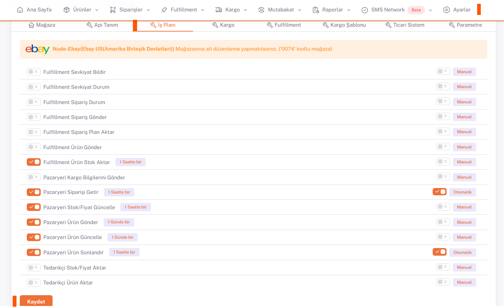
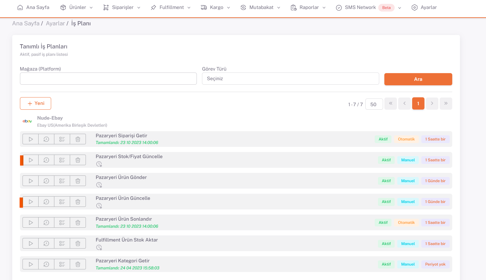

# Ebay İş Planları 

Ebay için *kategori eşleştirme, varyant eşleştirme, ürün içeriği ve fiyat düzenlemeleri* yapıldıktan sonra **Ayarlar > Mağazalar > Ebay > İş Planı** sayfasında ilgili iş planlarını *Manuel/Otomatik* olarak belirleyip aktif hale getirmeniz gerekmektedir.

## Ayarlar > İş Planı 

Bu işlemi yaptıktan sonra **Ayarlar > İş Planı** altından Ebay tab’i altındaki “**Pazaryeri Ürün Gönder**” iş planı yan üçgen sembolü olan çalıştır butonu ile çalıştırılır. Bu iş planı tamamlandıktan sonra ise “**Pazaryeri Stok/Fiyat Güncelle**” iş planı aynı şekilde çalıştırılır. 

:::caution
İş planları sonucunda hatalı ya da uyarı şeklinde verilen ürün bazlı hata mesajlarını inceleyip gerekli düzeltmeleri yaparak iş planını tekrardan çalıştırmanız gereklidir. 

Bu işlemler sonrasında iş planları sonuçlarına göre başarılı olarak gönderilen ürünler Ebay’de satışa başarılı bir şekilde açılır. 
:::

