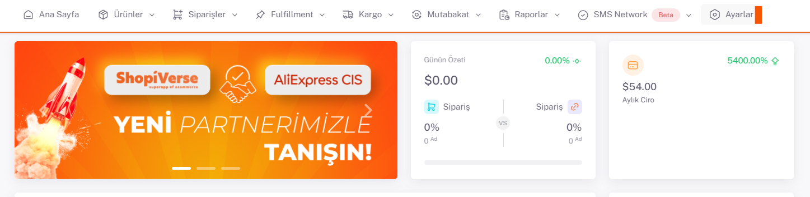
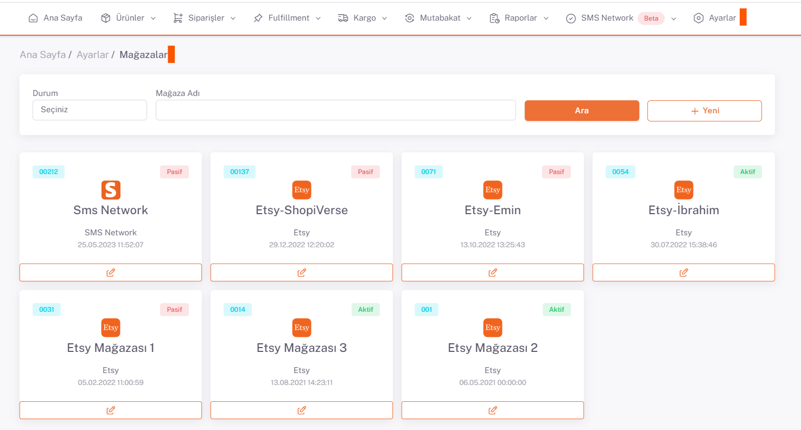
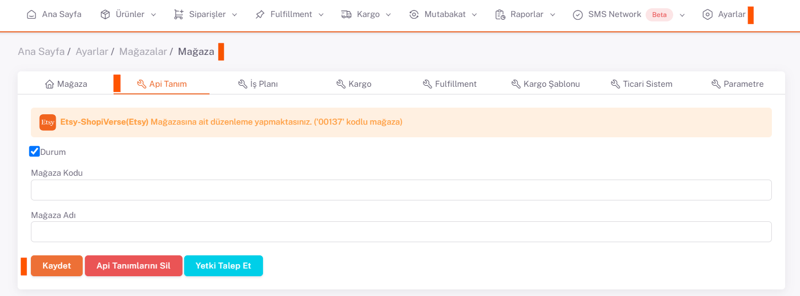

# Etsy API Entegrasyonu

## Entegrasyon Süreci Öncesinde Yapılması Gerekenler ve Önemli Bilgiler

Etsy’de her bir varyantlı ürün için toplamdan **10 görsel** hakkı vermektedir, ürünlerinizin birden çok renk varyantı varsa bu durum sorun yaratabilir. Detaylı bilgileri ticket açarak öğrenebilirsiniz.
Etsy’de **kargo şablonu**nun oluşturulması gerekmektedir. Etsy paneli üzerinden “**Settings > Delivery Settings > Delivery Setting**” üzerinden işlem sağlayabilirsiniz.
Ürün ölçü bilgilerinin (En x Boy x Yükseklik x Ağırlık) doğru bir şekilde ShopiVerse’deki ürünler üzerinde girilmiş olması lazım. Ölçü bilgileri olmadan ürünler Etsy'e aktarılamamaktadır.
 
**Etsy** API entegrasyonu için; ShopiVerse panelinden **Ayarlar > Mağazalar > Etsy >  API Tanımı** alanı altındaki `Durum` kısmını tikleyip, **Mağaza adı** kısmına da (*mağaza linki değil “etsy.com/shop/xxxxx” sadece mağaza adı “xxxxx”*)  **Etsy mağazanızın adını birebir aynı olacak şekilde** girerek “**Kaydet**” butonuna tıklayıp daha sonra sayfa yeniden yüklendiğinde oluşacak “**Yetki Talep Et**” butonu ile *Etsy paneline giderek kullanıcı girişi* yapıp, istenilen bilgilere izin veriliyor ve Etsy ile api entegrasyon bağlantımız tamamlanmış oluyor. 

## Ayarlar

 
## Mağazalar > Etsy

## Etsy > API Tanımı

:::caution
Not: **Mağaza adı** kısmına **Etsy mağazanızın adını birebir aynı olacak şekilde** girerek “**Kaydet**” butonuna tıklayın ve istenilen bilgilere izin verin.
:::