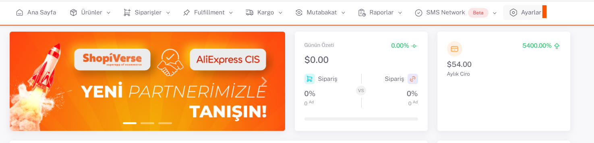
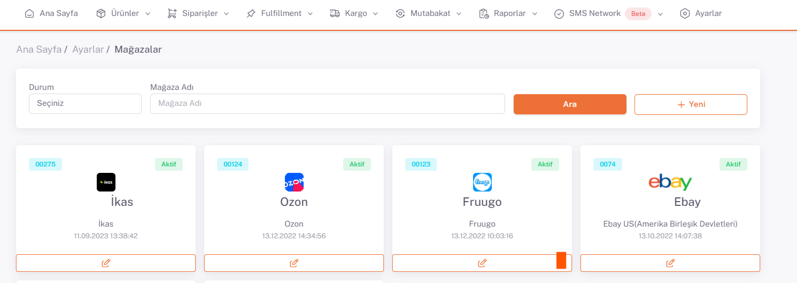
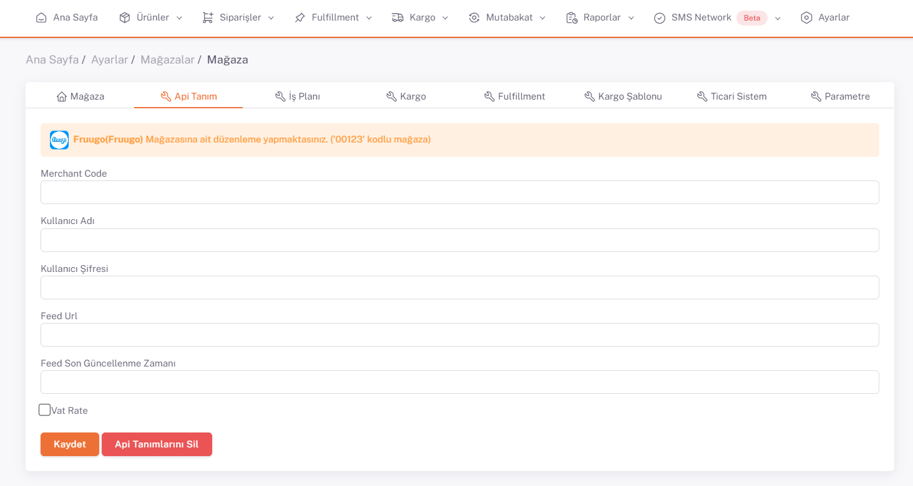

# Fruugo Entegrasyonu

## Entegrasyon Süreci Öncesinde Yapılması Gerekenler ve Önemli Bilgiler

Fruugo’da ürün listelemeye başlamadan önce panel üzerinde Shipping Method ayarlamalarının yapılması gerekmektedir.
Ürünlerinizi hangi **currency (para birimi)** ile satmak istiyorsanız bunun bildirimini ve ilgili currency’e göre banka bilgilerinizin tanımlamalarını yapmanız gerekmektedir.

## Fruugo API Entegrasyonu

**Fruugo** API entegrasyonu için; ShopiVerse panelinden **Ayarlar > Mağazalar > Fruugo >  API Tanımı** alanı altındaki “`Kullanıcı Adı`” ve “`Şifre`” bilgilerinizi girerek sipariş entegrasyonunu sağlıyoruz.

## Ayarlar

 
## Mağazalar > Fruugo

## Fruugo > API Tanımı

**Fruugo API entegrasyonu** için; ShopiVerse panelinden **Ayarlar > Mağazalar > Fruugo >  API Tanım** alanı altında aşağıdaki alanların doldurulması gerekmektedir.

  

**Ürün gönderim, stok fiyat güncellemeleri** için ise kategori eşleştirmeleri yapıldıktan sonra feed gönderimi yaparak ürünlerimizi Fruugo’ya aktarıyoruz. 

:::caution

**Merchant Code**: Fruugo Retail ID bilginizi bu alana girmeniz gerekmektedir. Bu bilgiyi Fruugo panelinde “Account Settings > Company Details” sayfası altında bulabilirsiniz.
**Kullanıcı Adı**: Fruugo hesabınıza giriş yaptığınız mail adresi
**Kullanıcı Şifresi**: Fruugo hesabınıza giriş yaptığınız şifre bilgisi
Bu bilgileri girdikten sonra Kaydet butonuna tıklayarak işlemi tamamlayabilirsiniz. Sonrasında ShopiVerse, Fruugo teknik ekibine webhook linki ileterek entegrasyon bağlantısını sağlamış olacaktır.

:::

