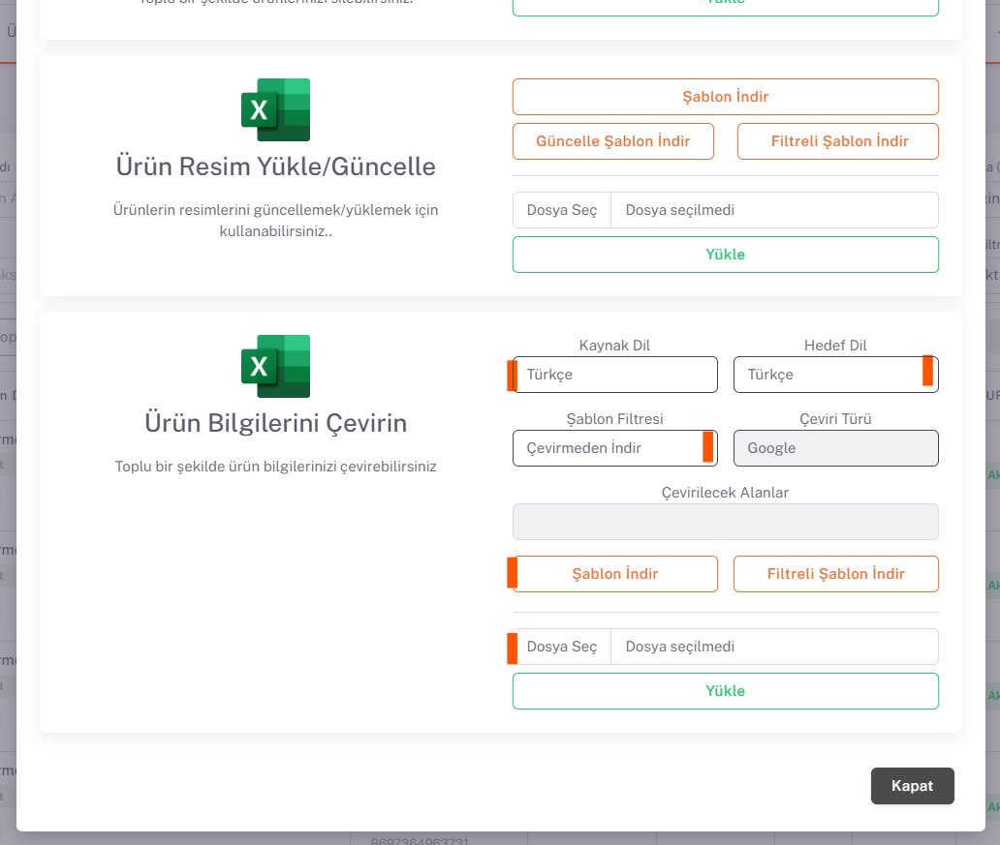

# Fruugo Ürün İçeriği ve Fiyat Özelleştirme 

## Excel İşlemleri

*Ürünler* sayfasında Excel İşlemleri altında “**Ürün Bilgilerini Çevirin**” alanında “**Kaynak Dil (ürünler hangi dilde ise)**” ve “**Hedef Dil (ürünler hangi dile çevrilmek isteniyorsa)**” seçenekleri seçilir ve “*Çevirerek İndir*” olarak seçilip şablon indir butonu ile ürün bilgilerinizin çevrilmiş halini excel çıktısı ile alırsınız.

Bu excelde yapmak istediğiniz düzenlemeler olursa onları da yaparak aynı yer üzerinden “*Dosya Seç*” ve “*Yükle*” diyerek indirilen şablon geri yüklenir ve ham datadaki ürün bilgilerinizde çeviri yapılan dile ait bilgiler de oluşur. 

## Parametre

Daha sonra **Ayarlar > Mağazalar > Fruugo > Parametre** sayfası altında “*Mağaza Ürün Dili*” İngilizce olarak seçilir. 

Bu işlemi yaptıktan sonra yine Ürünler sayfası altında **Excel İşlemleri > Mağaza Ürün Excel** kısmından Şablon İndir diyerek excel üzerinde fiyat bilgilerinizi ve para birimini güncelleyerek *(Fruugo panelinde belirlediğiniz currency/para birimini seçmeniz gerekmektedir.)* yine aynı alandan excelinizi yükleyebilirsiniz.
Fruugo ürün isimlerinde renk bilgisi olmasını istemiyor, ürün ismi oluştururken bu detaya dikkat etmeniz gerekmektedir.

