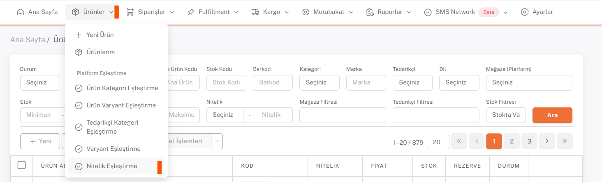

# Fruugo Nitelik Eşleştirme 

## Nitelik Eşleştirme

*Kategori eşleştirmeleri* tamamlandıktan sonra **Ürünler > Platform Eşleştirme > Nitelik Eşleştirme** sayfası açılır. Mağaza alanından **Fruugo** seçilir ve aşağıda nitelik değerleri olan *renk ve beden* bilgileri listelenir. 

İlgili nitelik değerinin sağ tarafında bulunan düzenle butonu ile nitelik eşleştirme sayfasını açıyoruz. Buradaki **Nitelik Değeri** alanına karşılık gelen **düzenle** butonu ile açılan sayfada “**Temizle**” butonu ile değerleri sıfırlayıp “**Ara**” diyerek platformun sunmuş olduğu nitelik değeri karşılıklarından uygun olan seçilir. Eğer istediğiniz nitelik değeri yok ise “Platform Nitelik Değeri” alanına freetext bilgi girerek Seç ve Kaydet diyerek eşleştirmeyi yapabilirsiniz ve bu her nitelik değeri için yapılmak zorundadır.

