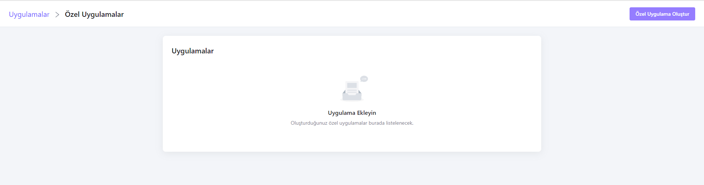
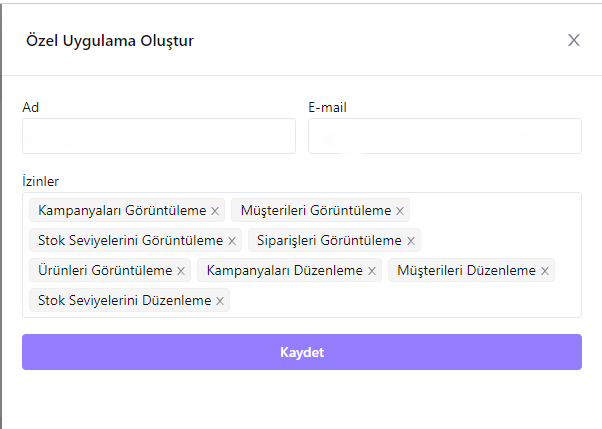
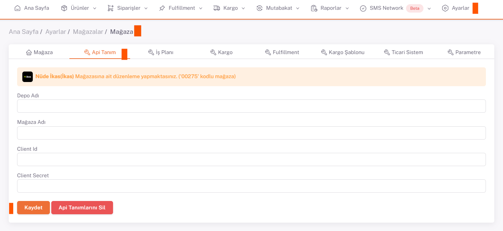

# İkas API Entegrasyonu

**İkas** API entegrasyonu için; ShopiVerse panelinden **Ayarlar > Mağazalar > İkas >  API Tanımı** alanı altındaki “`Client Secret`” ve “`Client ID`” bilgilerini doldurmamız gerekiyor. 

## Entegrasyon İçn Gerekli Bilgiler
 
Bunun için **https://accounts.ikas.com/register/t?_gl=1*2iosec*_gcl_au*MTkwMTEzODk4OC4xNjg1OTg3ODUz**
Adresine gidilir ve gerekli bilgiler doldurularak kayıt olunur. Daha sonra **‘Giriş Yap’** butonuna tıklanarak hesaba giriş yapılır. 

Önce *sol panel*den ‘**Uygulamalarım**’ a daha sonra *ana ekran*dan ‘**Uyguma Ekle’ > ‘Özel Uygulamalarınızı Yönetin**’ e tıklanır.

Açılan ekranda sağ üst köşedeki **‘Özel Uygulama Oluştur’** butonuna tıklanır. Açılan pencerede *gerekli bilgiler* doldurulur ve *izinler* seçilir.

Bilgiler kaydedildiğinde **Client Id ve Client Secret** oluşur.  Bu bilgiler *ShopiVerse paneli*nde **Ayarlar > Mağazalar > Ikas > Api Tanım** sayfasında gerekli alanlara girilir.

Burada **Mağaza Adı ve Depo Adı** bilgileri de gereklidir. Eğer herhangi bir depo oluşturmadıysanız bu kısma **‘Ana Depo’** yazmalısınız.

