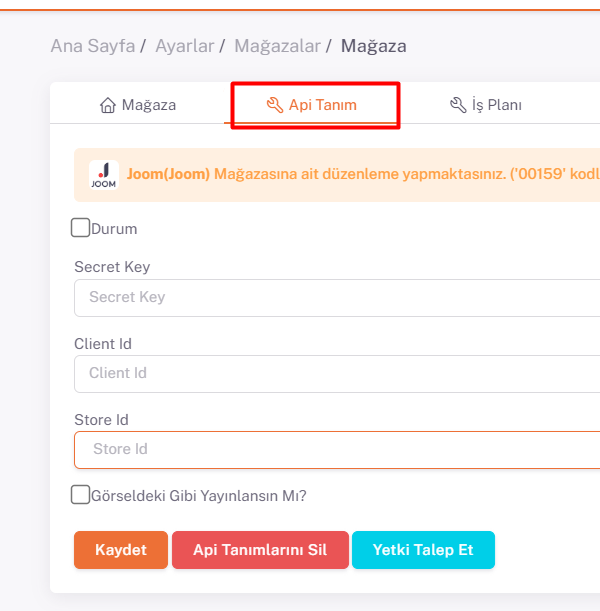

# Joom API Entegrasyonu

## Entegrasyon Süreci Öncesinde Yapılması Gerekenler ve Önemli Bilgiler

Joom’da görseller kare olmalıdır. Dikdörtgen görseller kabul edilebilir ancak ebatları **1:11 ve 3:4** arasında olmalıdır.
Ürün ölçü bilgilerinin (En x Boy x Yükseklik x Ağırlık) doğru bir şekilde ShopiVerse’deki ürünler üzerinde girilmiş olması lazım. Joom kargo ve gümrük maliyetlerini direkt müşteriden almaktadır, burada girilen bilgilere göre kargo maliyeti oluşturarak ürün fiyatının üzerine ekleme yapmaktadır.

**Joom** API entegrasyonu için; ShopiVerse panelinden **Ayarlar > Mağazalar > Joom >  API Tanımı** alanı altındaki “`Secret Key`” ve “`Client ID`” ve “`Store ID`” bilgilerini doldurmamız gerekiyor. 

## Ayarlar

 
## Mağazalar > Joom

## Joom > API Tanımı

## Entegrasyon İçn Gerekli Bilgiler
 
Bunun için https://merchant.joom.com/panel/stores adresi altında “**Yeni Mağaza Aç**” ile mağaza oluşturup daha sonra oluşturduğumuz mağaza adına tıklayarak mağaza detay sayfasına gidiyoruz, buradaki “**Genel Bilgi**” alanındaki “**Kimlik No**” altında yazan **kodu** kopyalıyoruz ve *Shopiverse Mağaza Apı Tanımında* **StoreId** bölümüne yapıştırıyoruz.

Daha sonra Joom panelinde sağ üst tarafta bulunan hesap bilgileriniz alanında “**API Uygulamaları**” sayfasına gidiyoruz. Burada “**Yeni Uygulama Oluştur**” butonuna tıklıyoruz. Burada Unvan kısmına “**ShopiVerse**” Mağaza kısmında oluşturduğunuz mağazayı seçiyoruz. “**Yeniden Yönlendirme URL’si**” alanına ise “`https://app.shopiverse.tech/tr/settings/store/joomcallbackcode`” yazıyoruz ve kaydet diyoruz. 

Daha sonra açılan sayfada **ünvan adına** tıklayarak açılan sayfada “**Müşteri Kimlik Numarası**” alanını ShopiVerse panelindeki “**Client ID**” alanına; “**Gizli Anahtar**” alanını ShopiVerse panelindeki “**Secret Key**” alanına giriyoruz ve Durum kısmını tikleyerek kaydet diyoruz. 

Daha sonra sayfa yeniden yüklendiğinde oluşacak “**Yetki Talep Et**” butonu ile Joom paneline giderek kullanıcı girişi yapıp, istenilen bilgilere izin veriliyor ve Joom ile api entegrasyon bağlantımız tamamlanmış oluyor. 