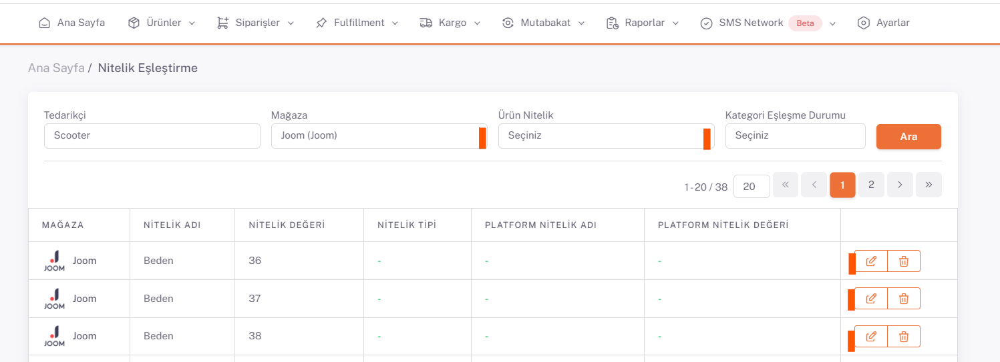

# Joom Nitelik Eşleştirme 

## Nitelik Eşleştirme

*Kategori eşleştirmeleri* tamamlandıktan sonra **Ürünler > Platform Eşleştirme > Nitelik Eşleştirme** sayfası açılır. Mağaza alanından Joom seçilir ve aşağıda nitelik değerleri olan renk ve beden bilgileri listelenir. 

İlgili nitelik değerinin sağ tarafında bulunan **düzenle** butonu ile nitelik eşleştirme sayfasını açıyoruz.

Buradaki Nitelik Değeri alanına karşılık gelen düzenle butonu ile açılan sayfada “**Temizle**” butonu ile değerleri sıfırlayıp “**Ara**” diyerek platformun sunmuş olduğu nitelik değeri karşılıklarından uygun olan seçilir ve bu her nitelik değeri için yapılır. Renk değerleri için “as the picture” yazarak eşleştirme yapılabilir, bu işlem sonrasında Joom’da yayınlanacak farklı görsel/renk varyasyonlarında “Görseldeki gibidir” seçeneği ile ürünlerinizi satışa açabilirsiniz.

