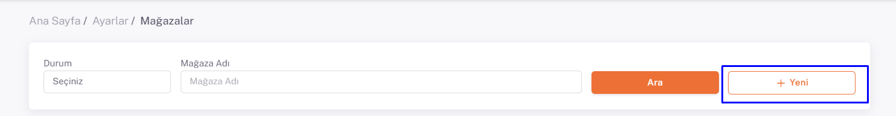

# Ozon API Entegrasyonu

## Entegrasyon Süreci Öncesinde Yapılması Gerekenler ve Önemli Bilgiler

Ozon hesabınız açılıp ürün yükleme süreçlerine başlamadan önce Marka tanımını Ozon paneli üzerinden yapmanız gerekmektedir. Tanımlama yapıldıktan sonra ShopiVerse paneli üzerinden yapılacak eşleştirmelerde bu bilgi kullanılacaktır. Ozon panelinde “**Ürünler ve Fiyatlar > Markalar > Marka Başvuruları**” sayfası altından yapabilirsiniz. 

Ürün ölçü bilgilerinin *(En x Boy x Yükseklik x Ağırlık)* doğru bir şekilde ShopiVerse’deki ürünler üzerinde girilmiş olması lazım. **Ölçü bilgileri olmadan ürünler Ozon’a aktarılamamaktadır.** 

## Ozon API Entegrasyonu

**Ozon** API entegrasyonu için; ShopiVerse panelinden **Ayarlar > Mağazalar > Ozon >  API Tanımı** alanı altındaki “`Client ID`” ve “`Api Key`” bilgilerini doldurmamız gerekiyor. 
**Ozon API entegrasyonu** için; ShopiVerse panelinden **Ayarlar > Mağazalar > Ozon >  API Tanım** alanı altında “*Client ID*” ve “*API Key*” bilgilerini doldurmamız gerekiyor. 
Ozon mağazanız görünmüyorsa **Yeni** menüsünden Ozon pazaryerini ekleyebilirsiniz. 

## Yeni Mağaza

## Ayarlar

## Mağazalar > Ozon

 
## Ozon > API Tanımı

## Client ID - API Key Almak İçin

Client ID - API Key Almak için 
 https://seller.ozon.ru/app/settings/api-keys adresi altındaki “**Müşteri Kimliği**” alanındaki numarayı “**Client ID**” bölümüne ekliyoruz. 

API Anahtarı kısmından ise “**Anahtar Oluştur**” alanına tıklayarak “**Anahtar Adı**” kısmına “*ShopiVerse*” yazarak ve “**Roller**” kısmında “*Admin*” alanını işaretleyerek Oluştur diyoruz ve oradaki API Key numarasını da ShopiVerse panelindeki “**API Key**” alanına giriyoruz. 

Entegrasyonu tamamlayabilmek için **Warehouse Code** bilgisini de almamız gerekiyor. **Lojistik > Depolar ve Yöntemler > Depo isminizin sağındaki 3 nokta simgesi > Kalanların Yönetimi** sayfasına geldikten sonra aşağıda kırmızı ile işaretli alandaki kodu yine ShopiVerse panelindeki **"Warehouse Code”** alanına girmeniz gerekmektedir. 

