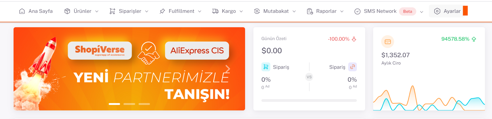

# Ozon API Entegrasyonu

**Ozon** API entegrasyonu için; ShopiVerse panelinden **Ayarlar > Mağazalar > Ozon >  API Tanımı** alanı altındaki “`Client ID`” ve “`Api Key`” bilgilerini doldurmamız gerekiyor. 

## Ayarlar

## Mağazalar > Ozon

 
## Ozon > API Tanımı

## Client ID - API Key Almak İçin

Client ID - API Key Almak için 
 https://seller.ozon.ru/app/settings/api-keys adresi altındaki “**Müşteri Kimliği**” alanındaki numarayı “**Client ID**” bölümüne ekliyoruz. 

*Token Türü* altındaki Anahtar Oluşturma alanına “**ShopiVerse**” yazarak Anahtar Oluştur diyoruz ve oradaki *Api Key* numarasını da *ShopiVerse* panelindeki “**Api Key**” alanına giriyoruz. 

ShopiVerse api tanım alanına bilgileri girdikten sonra **Kaydet** diyoruz, bu işlemden sonra **Yetki Talep Et** butonu aktif oluyor, bu butona tıklayarak Ozon paneline giderek kullanıcı girişi yapıp, istenilen bilgilere izin veriliyor ve Ozon ile api entegrasyon bağlantımız tamamlanmış oluyor. 

