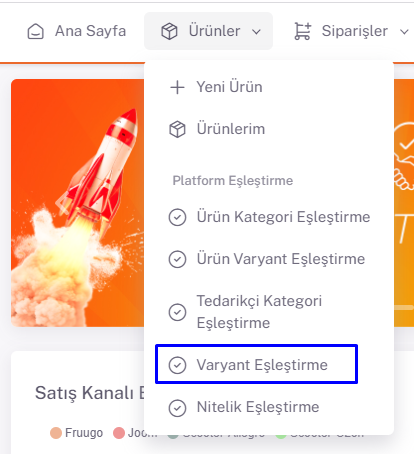
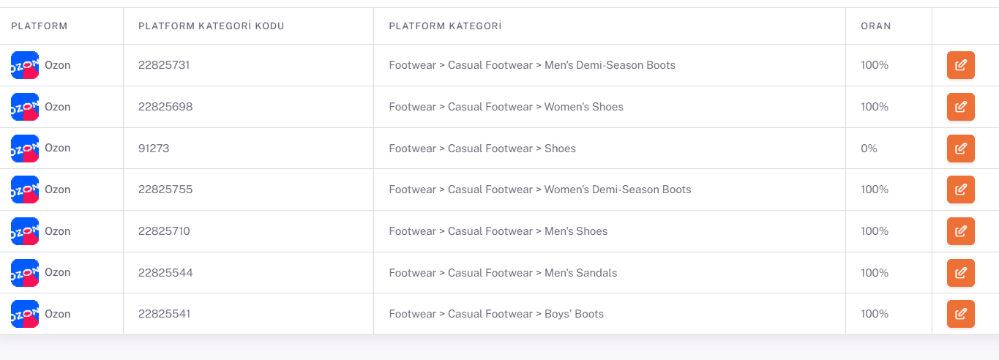
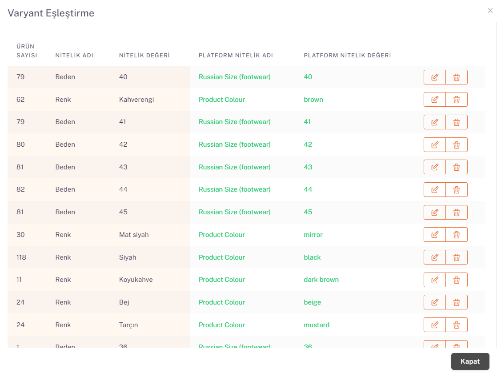

# Ozone Variant Matching

## Variant Matching

After *category matching* is completed, the **Products > Variant Matching** page opens.

## Edit
Ozon is selected from the Store area and the information of the categories for which you made category matches is listed below.

We open the attribute matching page with the edit button on the right side of the relevant variant value. On the page that opens with the edit button corresponding to the Attribute Value field, the values are reset with the "**Clear**" button and the appropriate one is selected from the attribute value equivalents offered by the platform by clicking "**Search**" and this is done for each attribute value.

