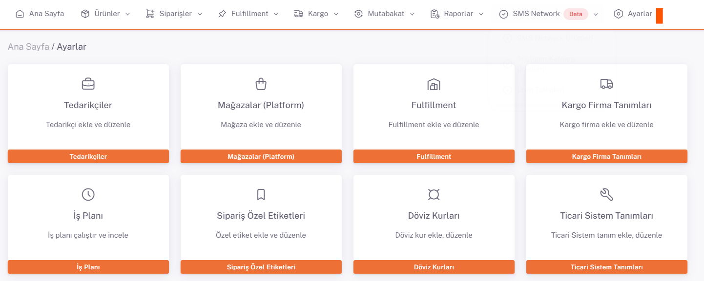

# Shopify API Entegrasyonu

**Shopify** API entegrasyonu için; https://www.shopify.com/partners giriş yapılır.**Sol menüden “App”**, sonra **sağ üstte “Create an app”** *App name* alanına “*ShopiVerse*” yazarak “**Create app**” butonuna tıklanır. Ekranda verilen “**API Key**” ve “**Api Key Secret**” değerleri veri tabanına marketplace parametre olarak kaydedilir.

ShopiVerse panelinden **Ayarlar > Mağazalar > Shopify >  API Tanımı** alanı altındaki “**Store Name**” alanını doldurmamız gerekiyor. 

## Ayarlar

 
## Mağazalar > Shopify

## Shopify > API Tanımı

